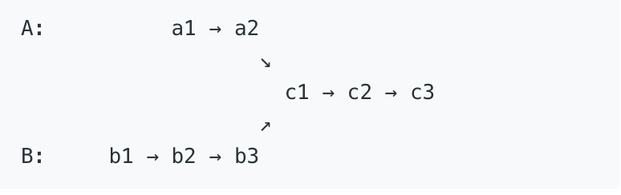

## 1.Stack

### 94.Binary Tree Inorder Traversal

Description:
Given a binary tree, return the inorder traversal of its nodes' values.
Example:
Input: [1,null,2,3]


Output: [1,3,2]


Follow up: Recursive solution is trivial, could you do it iteratively?


二叉树的中序遍历顺序为左-根-右，可以有递归和非递归来解，其中非递归解法又分为两种，一种是使用栈来接，另一种不需要使用栈。我们先来看递归方法，十分直接，对左子结点调用递归函数，根节点访问值，右子节点再调用递归函数，代码如下：

```C++
// Recursion
class Solution {
public:
    vector<int> inorderTraversal(TreeNode *root) {
        vector<int> res;
        inorder(root, res);
        return res;
    }
    void inorder(TreeNode *root, vector<int> &res) {
        if (!root) return;
        if (root->left) inorder(root->left, res);
        res.push_back(root->val);
        if (root->right) inorder(root->right, res);
    }
};
```

下面我们再来看非递归使用栈的解法，也是符合本题要求使用的解法之一，需要用栈来做，思路是从根节点开始，先将根节点压入栈，然后再将其所有左子结点压入栈，然后取出栈顶节点，保存节点值，再将当前指针移到其右子节点上，若存在右子节点，则在下次循环时又可将其所有左子结点压入栈中。这样就保证了访问顺序为左-根-右，代码如下：

```C++
// Non-recursion
/**
 * Definition for a binary tree node.
 * struct TreeNode {
 *     int val;
 *     TreeNode *left;
 *     TreeNode *right;
 *     TreeNode(int x) : val(x), left(NULL), right(NULL) {}
 * };
 */
class Solution {
public:
    vector<int> inorderTraversal(TreeNode* root) {
       vector<int> res;
       stack<TreeNode* > s;
       TreeNode* p=root;
       while(p || !s.empty()){//理解循环条件设置的意义
           while(p){
               s.push(p);
               p=p->left;
           }
           TreeNode * temp=s.top();
           res.push_back(temp->val);
           s.pop();
           p=temp->right;
       }
       return res;
    }
};
```

下面这种解法跟Binary Tree Preorder Traversal中的解法二几乎一样，就是把结点值加入结果res的步骤从if中移动到了else中，因为中序遍历的顺序是左-根-右，参见代码如下：
```C++
class Solution {
public:
    vector<int> inorderTraversal(TreeNode* root) {
        vector<int> res;
        stack<TreeNode*> s;
        TreeNode *p = root;
        while (!s.empty() || p) {
            if (p) {
                s.push(p);
                p = p->left;
            } else {
                TreeNode *t = s.top(); s.pop();
                res.push_back(t->val);
                p = t->right;
            }
        }
        return res;
    }
};
```

### 144.Binary Tree Preorder Traversal
Given a binary tree, return the preorder traversal of its nodes' values.
Example:
Input: [1,null,2,3]


Output: [1,2,3]

Follow up: Recursive solution is trivial, could you do it iteratively?

第一种：递归
```c++
/**
 * Definition for a binary tree node.
 * struct TreeNode {
 *     int val;
 *     TreeNode *left;
 *     TreeNode *right;
 *     TreeNode(int x) : val(x), left(NULL), right(NULL) {}
 * };
 */
class Solution {
public:
    vector<int> preorderTraversal(TreeNode* root) {
        vector <int> res;
        preorder(root,res);
        return res;
    }
    
    void preorder(TreeNode* root, vector<int> &res){
        if(!root)
            return ;
        res.push_back(root->val);
        preorder(root->left,res);
        preorder(root->right,res);
        
    }
};
```

第二种：使用栈

一般我们提到树的遍历，最常见的有先序遍历，中序遍历，后序遍历和层序遍历，它们用递归实现起来都非常的简单。而题目的要求是不能使用递归求解，于是只能考虑到用非递归的方法，这就要用到stack来辅助运算。由于先序遍历的顺序是"根-左-右", 算法为：

1.把根节点push到栈中

2.循环检测栈是否为空，若不空，则取出栈顶元素，保存其值，然后看其右子节点是否存在，若存在则push到栈中。再看其左子节点，若存在，则push到栈中。

```c++
class Solution {
public:
    vector<int> preorderTraversal(TreeNode* root) {
        vector <int> res;
        stack<TreeNode*>s;
        if(root==NULL) 
            return res;
        s.push(root);
        while(!s.empty()){
            TreeNode* temp=s.top();
            res.push_back(temp->val);
            s.pop();
            if(temp->right) s.push(temp->right);
            if(temp->left) s.push(temp->left);
        }
        return res;
    }
};
```
第三种：
下面这种写法使用了一个辅助结点p，这种写法其实可以看作是一个模版，对应的还有中序和后序的模版写法，形式很统一，方便于记忆。辅助结点p初始化为根结点，while循环的条件是栈不为空或者辅助结点p不为空，在循环中首先判断如果辅助结点p存在，那么先将p加入栈中，然后将p的结点值加入结果res中，此时p指向其左子结点。否则如果p不存在的话，表明没有左子结点，我们取出栈顶结点，将p指向栈顶结点的右子结点，参见代码如下：

```c++
class Solution {
public:
    vector<int> preorderTraversal(TreeNode* root) {
        vector<int> res;
        stack<TreeNode*> s;
        TreeNode *p = root;
        while (!s.empty() || p) {
            if (p) {
                s.push(p);
                res.push_back(p->val);
                p = p->left;
            } else {
                TreeNode *t = s.top(); 
                s.pop();
                p = t->right;
            }
        }
        return res;
    }
};
```

### 145.Binary Tree Postorder Traversal

Given a binary tree, return the postorder traversal of its nodes' values.
Example:
Input: [1,null,2,3]


Output: [3,2,1]
Follow up: Recursive solution is trivial, could you do it iteratively?

解法一：递归
```c++
/**
 * Definition for a binary tree node.
 * struct TreeNode {
 *     int val;
 *     TreeNode *left;
 *     TreeNode *right;
 *     TreeNode(int x) : val(x), left(NULL), right(NULL) {}
 * };
 */
class Solution {
public:
    vector<int> postorderTraversal(TreeNode* root) {
        vector<int >res;
        postorder(root,res);
        return res;
    }
    void postorder(TreeNode* root, vector <int>&res){
        if(!root) return ;
        // if(root->left==NULL) 
            postorder(root->left,res);
        // if(root->right==NULL) 
            postorder(root->right,res);
        res.push_back(root->val);
        
    }
};
```
这两句判断加上就是错的，想下为什么，做算法题，类似的很多，不要想都不想都照搬以前相似的题，往往会把自己搞迷糊，写算法，最重要的是先明白算法的整个过程，如果想不明白，就不要写。迷迷糊糊照搬以前的经验，不可取，很容易形成误导

解法二：栈

经典题目，求二叉树的后序遍历的非递归方法，跟前序，中序，层序一样都需要用到栈，后续的顺序是左-右-根，所以当一个节点值被取出来时，它的左右子节点要么不存在，要么已经被访问过了。我们先将根结点压入栈，然后定义一个辅助结点head，while循环的条件是栈不为空，在循环中，首先将栈顶结点t取出来，如果栈顶结点没有左右子结点，或者其左子结点是head，或者其右子结点是head的情况下。我们将栈顶结点值加入结果res中，并将栈顶元素移出栈，然后将head指向栈顶元素；否则的话就看如果右子结点不为空，将其加入栈，再看左子结点不为空的话，就加入栈，注意这里先右后左的顺序是因为栈的后入先出的特点，可以使得左子结点先被处理。下面来看为什么是这三个条件呢，首先如果栈顶元素如果没有左右子结点的话，说明其是叶结点，而且我们的入栈顺序保证了左子结点先被处理，所以此时的结点值就可以直接加入结果res了，然后移出栈，将head指向这个叶结点，这样的话head每次就是指向前一个处理过并且加入结果res的结点，那么如果栈顶结点的左子结点或者右子结点是head的话，说明其子结点已经加入结果res了，那么就可以处理当前结点了，代码如下


```c++
class Solution {
public:
    vector<int> postorderTraversal(TreeNode* root) {
        if (!root) return {};
        vector<int> res;
        stack<TreeNode*> s{{root}};
        TreeNode *head = root;
        while (!s.empty()) {
            TreeNode *t = s.top();
            if ((!t->left && !t->right) || t->left == head || t->right == head) {
                res.push_back(t->val);
                s.pop();
                head = t;
            } else {
                if (t->right) s.push(t->right);
                if (t->left) s.push(t->left);
            }
        }
        return res;
    }
};
```

解法三：
由于后序遍历的顺序是左-右-根，而先序遍历的顺序是根-左-右，二者其实还是很相近的，我们可以先在先序遍历的方法上做些小改动，使其遍历顺序变为根-右-左，然后翻转一下，就是左-右-根啦，翻转的方法我们使用反向Q，哦不，是反向加入结果res，每次都在结果res的开头加入结点值，而改变先序遍历的顺序就只要该遍历一下入栈顺序，先左后右，这样出栈处理的时候就是先右后左啦，参见代码如下：

```c++
class Solution {
public:
    vector<int> postorderTraversal(TreeNode* root) {
        if (!root) return {};
        vector<int> res;
        stack<TreeNode*> s{{root}};
        while (!s.empty()) {
            TreeNode *t = s.top(); 
            s.pop();
            res.insert(res.begin(), t->val);
            if (t->left) s.push(t->left);
            if (t->right) s.push(t->right);
        }
        return res;
    }
};
```

解法四：
那么在Binary Tree Preorder Traversal中的解法二也可以改动一下变成后序遍历，改动的思路跟上面的解法一样，都是先将先序遍历的根-左-右顺序变为根-右-左，再翻转变为后序遍历的左-右-根，翻转还是改变结果res的加入顺序，然后把更新辅助结点p的左右顺序换一下即可，代码如下：

```c++
class Solution {
public:
    vector<int> postorderTraversal(TreeNode* root) {
        vector<int> res;
        stack<TreeNode*> s;
        TreeNode *p = root;
        while (!s.empty() || p) {
            if (p) {
                s.push(p);
                res.insert(res.begin(), p->val);
                p = p->right;
            } else {
                TreeNode *t = s.top(); 
                s.pop();
                p = t->left;
            }
        }
        return res;
    }
};
```

解法五：
论坛上还有一种双栈的解法，其实本质上跟解法二没什么区别，都是利用了改变先序遍历的顺序来实现后序遍历的，参见代码如下：

```c++
class Solution {
public:
    vector<int> postorderTraversal(TreeNode* root) {
        if (!root) return {};
        vector<int> res;
        stack<TreeNode*> s1, s2;
        s1.push(root);
        while (!s1.empty()) {
            TreeNode *t = s1.top(); s1.pop();
            s2.push(t);
            if (t->left) s1.push(t->left);
            if (t->right) s1.push(t->right);
        }
        while (!s2.empty()) {
            res.push_back(s2.top()->val); s2.pop();
        }
        return res;
    }
};
```

### 使用栈实现二叉树的三种遍历

#### 前序

下面这种写法使用了一个辅助结点p，这种写法其实可以看作是一个模版，对应的还有中序和后序的模版写法，形式很统一，方便于记忆。辅助结点p初始化为根结点，while循环的条件是栈不为空或者辅助结点p不为空，在循环中首先判断如果辅助结点p存在，那么先将p加入栈中，然后将p的结点值加入结果res中，此时p指向其左子结点。否则如果p不存在的话，表明没有左子结点，我们取出栈顶结点，将p指向栈顶结点的右子结点，参见代码如下：

```c++
class Solution {
public:
    vector<int> preorderTraversal(TreeNode* root) {
        vector<int> res;
        stack<TreeNode*> s;
        TreeNode *p = root;
        while (!s.empty() || p) {
            if (p) {
                s.push(p);
                res.push_back(p->val);
                p = p->left;
            } else {
                TreeNode *t = s.top(); 
                s.pop();
                p = t->right;
            }
        }
        return res;
    }
};
```


#### 中序
```c++

```

#### 后续
```c++

```

### 150.Evaluate Reverse Polish Notation
    栈计算逆波兰表达式（Reverse Polish Notation)

atio() //字符串转化为整型数字
```c++
class Solution {
public:
    int evalRPN(vector<string> &tokens) {
        if (tokens.size() == 1) return atoi(tokens[0].c_str());
        stack<int> s;
        for (int i = 0; i < tokens.size(); ++i) {
            if (tokens[i] != "+" && tokens[i] != "-" && tokens[i] != "*" && tokens[i] != "/") 
　　　　　　　{
                s.push(atoi(tokens[i].c_str()));
            } else {
                int m = s.top();
                s.pop();
                int n = s.top();
                s.pop();
                if (tokens[i] == "+") s.push(n + m);
                if (tokens[i] == "-") s.push(n - m);
                if (tokens[i] == "*") s.push(n * m);
                if (tokens[i] == "/") s.push(n / m);
            }
        }
        return s.top();
    }
};
```
注意出入栈顺序，先入的数后出栈，比如你下面犯的这种低级错误
```c++
if(tokens[i]=="/"){
                num1=s.top();s.pop();
                num2=s.top();s.pop();
                res=num1/num2;
                s.push(res);
```


## 2.Greedy

### 402. Remove K Digits

Given a non-negative integer num represented as a string, remove k digits from the number so that the new number is the smallest possible.

Note:

* The length of num is less than 10002 and will be ≥ k.
* The given num does not contain any leading zero.

Example 1:
```
Input: num = "1432219", k = 3
Output: "1219"
Explanation: Remove the three digits 4, 3, and 2 to form the new number 1219 which is the smallest.
```
Example 2:
```
Input: num = "10200", k = 1
Output: "200"
Explanation: Remove the leading 1 and the number is 200. Note that the output must not contain leading zeroes.
```

Example 3:
```
Input: num = "10", k = 2
Output: "0"
Explanation: Remove all the digits from the number and it is left with nothing which is 0.
```

思路：

baseline:观察规律可知（这个很重要），要使得最后取出来的数字最小，就按序号遍历字符串，凡是遇到一个数字比他相邻后面的数字大时，就移除他，这样就基本能保证满足条件。比如
um = "1432219", k = 3 就可以。

但是还要考虑到像“222222”，“111123333”这种，这个还是按照上面的方法来，只是最后取前K个就好了。使用substr()函数

代码：
```c++
string removeKdigits(string num, int k){
    int len=num.size();
    string res="";
    string s;
    int count=0;
    if(len==k){
        res+="0";
        return res;
    }
    s.push_back(num[0]);
    for(int i=1;i<len;i++){
        //判断条件要考虑全面，细节决定成败
        while(s.back()>num[i] && count<k && !s.empty()){
            s.pop_back();
            count++;
        }
        s.push_back(num[i]);
    }

    //判断是否有“0”开头
    while(s[0]=='0' && !s.empty()){
        s=s.substr(1,s.size()-1);
    }

    //这两步写法不是很严谨
    if(s.size()==0)
        return "0";

    return s.substr(0,len-k);
}

```


### 406. Queue Reconstruction by Height

Suppose you have a random list of people standing in a queue. Each person is described by a pair of integers (h, k), where h is the height of the person and k is the number of people in front of this person who have a height greater than or equal to h. Write an algorithm to reconstruct the queue.

Note:
The number of people is less than 1,100.


Example:
```
Input:
[[7,0], [4,4], [7,1], [5,0], [6,1], [5,2]]

Output:
[[5,0], [7,0], [5,2], [6,1], [4,4], [7,1]]
```

思路：我们考虑如果先把个子高的排好序，那么在任何位置插入数据都不会对已经排好序的数组造成影响。而，与此同时，我们已经知道了个子高的排序，那么当新的数据到的时候，我们要确定它的位置也很简单，因为现在的所有数据都比他高，所以只要根据他的第二个数字确定他的位置即可。

先对已有的数组进行排序。按照高度降序排列，如果高度一样，按照k的值升序排列。这样比如一开始[7，0] [7，1] [7，2]就会排好，然后比如说后面有一个[6，1]， 说明只有一个大于或等于它，又因为比6大的已经全部取出。所以把它放在位置1，这样就变成[7，0] [6，1] [7，1] [7，2].然后比如又有一个[5，0].就放在位置0，以此类推。


代码：
```c++
//注意自定义sort()函数的比较方法。
class Solution {
public:
    vector<pair<int, int>> reconstructQueue(vector<pair<int, int>>& people) {
        sort(people.begin(), people.end(), [](const pair<int, int>& a, const pair<int, int>& b) {
            return a.first > b.first || (a.first == b.first && a.second < b.second);
        });
        vector<pair<int, int>> res;
        for (auto a : people) {
            res.insert(res.begin() + a.second, a);
        }
        return res;
    }
};    

```


### 921. Minimum Add to Make Parentheses Valid

Given a string S of '(' and ')' parentheses, we add the minimum number of parentheses ( '(' or ')', and in any positions ) so that the resulting parentheses string is valid.

Formally, a parentheses string is valid if and only if:

* It is the empty string, or

* It can be written as AB (A concatenated with B), where A and B are valid strings, or

* It can be written as (A), where A is a valid string.

Given a parentheses string, return the minimum number of parentheses we must add to make the resulting string valid.


### 763. Partition Labels

A string S of lowercase letters is given. We want to partition this string into as many parts as possible so that each letter appears in at most one part, and return a list of integers representing the size of these parts.

Example 1:
```
Input: S = "ababcbacadefegdehijhklij"
Output: [9,7,8]
Explanation:
The partition is "ababcbaca", "defegde", "hijhklij".
This is a partition so that each letter appears in at most one part.
A partition like "ababcbacadefegde", "hijhklij" is incorrect, because it splits S into less parts.

```

Note:

1.S will have length in range [1, 500].

2.S will consist of lowercase letters ('a' to 'z') only


关键点：hashmap

思路：

这道题给了我们一个字符串S，然我们将其尽可能多的分割为子字符串，条件是每种字符最多只能出现在一个子串中。比如题目汇总的例子，字符串S中有多个a，这些a必须只能在第一个子串中，再比如所有的字母e值出现在了第二个子串中。那么这道题的难点就是如何找到字符串的断点，即拆分成为子串的位置。我们仔细观察题目中的例子，可以发现一旦某个字母多次出现了，那么其最后一个出现位置必须要在当前子串中，字母a，e，和j，分别是三个子串中的结束字母。所以我们关注的是每个字母最后的出现位置，我们可以使用一个HashMap来建立字母和其最后出现位置之间的映射，那么对于题目中的例子来说，我们可以得到如下映射：

```
a -> 8
b -> 5
c -> 7
d -> 14
e -> 15
f -> 11
g -> 13
h -> 19
i -> 22
j -> 23
k -> 20
l -> 21
```

建立好映射之后，就需要开始遍历字符串S了，我们维护一个start变量，是当前子串的起始位置，还有一个last变量，是当前子串的结束位置，每当我们遍历到一个字母，我们需要在HashMap中提取出其最后一个位置，因为一旦当前子串包含了一个字母，其必须包含所有的相同字母，所以我们要不停的用当前字母的最后一个位置来更新last变量，只有当i和last相同了，即当i = 8时，当前子串包含了所有已出现过的字母的最后一个位置，即之后的字符串里不会有之前出现过的字母了，此时就应该是断开的位置，我们将长度9加入结果res中，同理类推，我们可以找出之后的断开的位置，参见代码如下：

代码：
```c++
class Solution {
public:
    vector<int> partitionLabels(string S) {
        vector<int> res;
        int n = S.size(), start = 0, last = 0;
        unordered_map<char, int> m;
        for (int i = 0; i < n; ++i) m[S[i]] = i;
        for (int i = 0; i < n; ++i) {
            last = max(last, m[S[i]]);
            if (i == last) {
                res.push_back(i - start + 1);
                start = i + 1;
            }
        }
        return res;
    }
};

```


### 55. Jump Game

Given an array of non-negative integers, you are initially positioned at the first index of the array.

Each element in the array represents your maximum jump length at that position.

Determine if you are able to reach the last index.

Example 1:

Input: [2,3,1,1,4]
Output: true
Explanation: Jump 1 step from index 0 to 1, then 3 steps to the last index.
Example 2:

Input: [3,2,1,0,4]
Output: false
Explanation: You will always arrive at index 3 no matter what. Its maximum jump length is 0, which makes it impossible to reach the last index.


```c++
bool canJump(int* nums, int numsSize) {
    int reach=nums[0];
    for(int i=1;i<numsSize && i<=reach;i++){
        if(i+nums[i] > reach)
            reach=i+nums[i];
    }
    return reach>=(numsSize-1)?true:false;
}
```

另一种思考：
这道题是动态规划的题目，所用到的方法跟是在[Maximum Subarray](http://blog.csdn.net/linhuanmars/article/details/21314059)中介绍的套路，用“局部最优和全局最优解法”。我们维护一个到目前为止能跳到的最远距离，以及从当前一步出发能跳到的最远距离。局部最优local=A[i]+i，而全局最优则是global=Math.max(global, local)。递推式出来了，代码就比较容易实现了。因为只需要一次遍历时间复杂度是O(n)，而空间上是O(1)。代码如下： 

```java
public boolean canJump(int[] A) {
    if(A==null || A.length==0)
        return false;
    int reach = 0;
    for(int i=0;i<=reach&&i<A.length;i++)
    {
        reach = Math.max(A[i]+i,reach);
    }
    if(reach<A.length-1)
        return false;
    return true;
}
```

这也是一道比较经典的动态规划的题目，不过不同的切入点可能会得到不同复杂度的算法，比如如果维护的历史信息是某一步是否能够到达，那么每一次需要维护当前变量的时候就需要遍历前面的所有元素，那么总的时间复杂度就会是O(n^2)。所以同样是动态规划，有时候也会有不同的角度，不同效率的解法。这道题目还有一个扩展Jump Game II，有兴趣的朋友可以看看

另一种思考：

一开始考虑用动态规划，当前位置i是否可以到达可以转化为，[0,...,i-1]区间的位置可以到达且该位置step大于与i的index差值，用一个boolean数组dp[]来存储之前的状态，然而写完就LTE了。。。不开心。。。因为每次判断都需要用到之前所有状态，太耗时了。

改进：用maxCover记录最大可到达距离，step记录仍然可走的步数，遍历数组更新这两个值，若step=0且没有走到数组尾部，则返回false；若遍历完成则返回true，这样只用扫描一遍且每一步都不需要再扫描之前每一步的状态。

原因是每次只用记录当前可以走到最大距离的那个状态！！！


```java
public class Solution {
    public boolean canJump(int[] nums) {
        if (nums.length == 0) return false;
        
        int maxCover = 0, step = 1;
        for (int i = 0; i < nums.length; i++) {
            step--;
            if (i + nums[i] > maxCover) {
                maxCover = i + nums[i];
                step = nums[i];
            }
            if (step == 0 && i < nums.length-1) 
                return false;
        }
        return true;
    }
}
```


### Minimum number of jumps to reach end

[Minimum number of jumps to reach end from geeksforgeeks](https://www.geeksforgeeks.org/minimum-number-of-jumps-to-reach-end-of-a-given-array/)
[Minimum number of jumps to reach end Set 2 from geeksforgeeks](https://www.geeksforgeeks.org/minimum-number-jumps-reach-endset-2on-solution/)


Method 1 (Naive Recursive Approach)

A naive approach is to start from the first element and recursively call for all the elements reachable from first element. The minimum number of jumps to reach end from first can be calculated using minimum number of jumps needed to reach end from the elements reachable from first.

递归访问第一个元素能到底的地方

minJumps(start, end) = Min ( minJumps(k, end) ) for all k reachable from start

```c++
#include <stdio.h>
#include <limits.h>
 
// Returns minimum number of jumps to reach arr[h] from arr[l]
//从arr[l]到arr[h]需要的最小步数，所以最开始的参数为minJumps(arr, 0, n-1)
int minJumps(int arr[], int l, int h)
{
   // Base case: when source and destination are same
   if (h == l)
     return 0;
 
   // When nothing is reachable from the given source
   if (arr[l] == 0)
     return INT_MAX;
 
   // Traverse through all the points reachable from arr[l]. Recursively
   // get the minimum number of jumps needed to reach arr[h] from these
   // reachable points. 遍历从arr[l]可以到达的所有点，递归得到到arr[h]需要的最小步数从这些可到达的点
   int min = INT_MAX; 
   for (int i = l+1; i <= h && i <= l + arr[l]; i++) //这个判断条件写得很好
   {
       int jumps = minJumps(arr, i, h);
       if(jumps != INT_MAX && jumps + 1 < min)
           min = jumps + 1;
   }
 
   return min;
}
 
// Driver program to test above function
int main()
{
  int arr[] = {1, 3, 6, 3, 2, 3, 6, 8, 9, 5};
  int n = sizeof(arr)/sizeof(arr[0]);
  printf("Minimum number of jumps to reach end is %d ", minJumps(arr, 0, n-1));
  return 0;
}
```


### 45. Jump Game II

Given an array of non-negative integers, you are initially positioned at the first index of the array.

Each element in the array represents your maximum jump length at that position.

Your goal is to reach the last index in the minimum number of jumps.

Example:

Input: [2,3,1,1,4]
Output: 2
Explanation: The minimum number of jumps to reach the last index is 2.
​    Jump 1 step from index 0 to 1, then 3 steps to the last index.
Note:

You can assume that you can always reach the last index.

这道题是Jump Game的扩展，区别是这道题不仅要看能不能到达终点，而且要求到达终点的最少步数。其实思路和Jump Game还是类似的，只是原来的全局最优现在要分成step步最优和step-1步最优（假设当前步数是step）。当走到超过step-1步最远的位置时，说明step-1不能到达当前一步，我们就可以更新步数，将step+1。时间复杂度仍然是O(n)，空间复杂度也是O(1)。代码如下：

```java
public int jump(int[] A) {
    if(A==null || A.length==0)
        return 0;
    int lastReach = 0;
    int reach = 0;
    int step = 0;
    for(int i=0;i<=reach&&i<A.length;i++)
    {
        if(i>lastReach)
        {
            step++;
            lastReach = reach;
        }
        reach = Math.max(reach,A[i]+i);
    }
    if(reach<A.length-1)
        return 0;
    return step;
}
```


### 392. Is Subsequence

Given a string s and a string t, check if s is subsequence of t.

You may assume that there is only lower case English letters in both s and t. t is potentially a very long (length ~= 500,000) string, and s is a short string (<=100).

A subsequence of a string is a new string which is formed from the original string by deleting some (can be none) of the characters without disturbing the relative positions of the remaining characters. (ie, "ace" is a subsequence of "abcde" while "aec" is not).

Example 1:
s = "abc", t = "ahbgdc"

Return true.

Example 2:
s = "axc", t = "ahbgdc"

Return false.

Follow up:
If there are lots of incoming S, say S1, S2, ... , Sk where k >= 1B, and you want to check one by one to see if T has its subsequence. In this scenario, how would you change your code?

思路：

这类题一定要考虑极端情况，很多时候都是在极端情况下出问题。比如长度都为1，这个时候，你的size()-1， 刚好就是第一项。
以及，判断如果到了t[size()-1]还往下运行了的话，一般都为false,但是你要考虑这个时候s[i]也可能是最后一项，刚好可以。
这些都是需要考虑到的，如果没有测试用例，你可能还真发现不了这些错误。所以要细心

```c++
class Solution {
public:
    bool isSubsequence(string s, string t) {
        if(s.size()==1 && t.size()==1){
             if(s[0]==t[0])
                return true;
             else 
                 return false;
        }
           
        int j=0;
        for(int i=0;i<s.size();i++){
            for(;j<t.size();j++){
                if(s[i]==t[j]){
                    j++;
                    break;    
                }
                          
            }
            if( j==t.size() && i!=s.size()-1 ) //"b" "c"通不过
                return false;
        }
        return true;
    }
};
```

解法二：
这道题算比较简单的一种，我们可以用两个指针分别指向字符串s和t，然后如果字符相等，则i和j自增1，反之只有j自增1，最后看i是否等于s的长度，等于说明s已经遍历完了，而且字符都有在t中出现过，参见代码如下：


```c++
class Solution {
public:
    bool isSubsequence(string s, string t) {
        if (s.empty()) return true;
        int i = 0, j = 0;
        while (i < s.size() && j < t.size()) {
            if (s[i] == t[j]) {
                ++i; ++j;
            } else {
                ++j;
            }
        }
        return i == s.size();
    }
};
```


### 122.Best Time to Buy and Sell Stock II 

## 3.DFS 


### 100. Same Tree
Given two binary trees, write a function to check if they are the same or not.
Two binary trees are considered the same if they are structurally identical and the nodes have the same value.
Example 1:
Input:    

    

Output: true
Example 2:
Input:     


Output: false
Example 3:
Input:    


Output: false

```c++
/**
 * Definition for a binary tree node.
 * struct TreeNode {
 *     int val;
 *     TreeNode *left;
 *     TreeNode *right;
 *     TreeNode(int x) : val(x), left(NULL), right(NULL) {}
 * };
 */
class Solution {
public:
    bool isSameTree(TreeNode* p, TreeNode* q) {
        if(p==NULL && q==NULL)
            return true;
        if((p && !q) || (!p &&q))
            return false;
        if(p->val==q->val)
            return true && isSameTree(p->left,q->left) && isSameTree(p->right,q->right);
        else
            return false;
    }
};
```

对于树这种题，要有这样一种思维，每个结点都是一棵树，从小范围思考。


### 257.Binary Tree Paths Easy

Given a binary tree, return all root-to-leaf paths.

For example, given the following binary tree:


这道题给我们一个二叉树，让我们返回所有根到叶节点的路径，跟之前那道Path Sum II很类似，比那道稍微简单一些，不需要计算路径和，只需要无脑返回所有的路径即可，那么思路还是用递归来解，博主之前就强调过，玩树的题目，十有八九都是递归，而递归的核心就是不停的DFS到叶结点，然后在回溯回去。在递归函数中，当我们遇到叶结点的时候，即没有左右子结点，那么此时一条完整的路径已经形成了，我们加上当前的叶结点后存入结果res中，然后回溯。注意这里结果res需要reference，而out是不需要引用的，不然回溯回去还要删除新添加的结点，很麻烦。为了减少判断空结点的步骤，我们在调用递归函数之前都检验一下非空即可，代码而很简洁，参见如下：

```c++
class Solution {
public:
    vector<string> binaryTreePaths(TreeNode* root) {
        vector<string> res;
        if (root) helper(root, "", res);
        return res;
    }
    void helper(TreeNode* node, string out, vector<string>& res) {
        if (!node->left && !node->right) 
            res.push_back(out + to_string(node->val));
        if (node->left) 
            helper(node->left, out + to_string(node->val) + "->", res);
        if (node->right) 
            helper(node->right, out + to_string(node->val) + "->", res);
    }
};
```

体会这个DFS的思想，其实和教材上是一个意思，下面是教材上的：
```c++
void DFS(Graph *G, int v){//Depth first search
    PreVisit(G,v);//Take appropriate action
    G->setMark(v,VISITED);
    for(int w=G->first(v);w<G->n();w=G->next(v,w)){
        if(G->getMark(w)==UNVISITED){
            DFS(G,w);
        }
    }
    PostVisit(G,v)//Take appropriate action
}
```

对比上面的那个代码，不就是用两个if代替了图中的for循环，来遍历所有邻近结点吗？是一样的思想
要是for中一个满足条件的都没有，那停止了，也是对应了上面左右子树都为空的时候，不递归了，
直接加入vector中了。一模一样的思想套路


### 101.Symmetric Tree

比较典型的一题

Given a binary tree, check whether it is a mirror of itself (ie, symmetric around its center).
For example, this binary tree [1,2,2,3,4,4,3] is symmetric:


But the following [1,2,2,null,3,null,3] is not:

Note:
Bonus points if you could solve it both recursively and iteratively.

```c++
/**
 * Definition for a binary tree node.
 * struct TreeNode {
 *     int val;
 *     TreeNode *left;
 *     TreeNode *right;
 *     TreeNode(int x) : val(x), left(NULL), right(NULL) {}
 * };
 */
class Solution {
public:
    bool isSymmetric(TreeNode* root) {
        if(root==NULL)
            return true;
        return helper(root->left,root->right);
    }
    bool helper(TreeNode* left, TreeNode* right){
       if(left==NULL && right==NULL)
           return true;//都为空
        else if(left && right){
            return left->val==right->val && helper(left->left,right->right) && helper(left->right,right->left);
        }else
            return false;//一空一不空
    }
};
```

### 494.Target Sum

You are given a list of non-negative integers, a1, a2, ..., an, and a target, S. Now you have 2 symbols + and -. For each integer, you should choose one from + and - as its new symbol.

Find out how many ways to assign symbols to make sum of integers equal to target S.

Example 1:


Note:
The length of the given array is positive and will not exceed 20.
The sum of elements in the given array will not exceed 1000.
Your output answer is guaranteed to be fitted in a 32-bit integer.


思路一，采用递归的解法，即暴力求解法，递归遍历每一种情况，如果到最后一个数和为s，那么把res++，否则就继续搜索。

```c++
class Solution {
public:
    int findTargetSumWays(vector<int>& nums, int S) {
        if(nums.size()==0)
            return 0;
        int res=0;//注意初始化，不然是错的
        helper(nums,0,S,res,0);
        return res;
        
    }

    void helper(vector<int>& nums,int index,int S,int &res,int sum){
        if(index==nums.size()){
            if(sum==S)
                res++;
            else
                return ;
        }else{
            helper(nums,index+1,S,res,sum+nums[index]);
            helper(nums,index+1,S,res,sum+(-1)*nums[index]);
        }
    }
        
};
```

但是上面这种方法简单粗暴，时间复杂度是（2^n）n是数字的个数，所以我们采用优化的算法

思路二：这种想法比较巧妙，一开始我也想到用01背包求解，但是不知道怎么处理负数的问题以及如何奇数的问题。我们来看如下例子：

nums = {1,2,3,4,5}, target=3, 一种可行的方案是+1-2+3-4+5 =3

该方案中数组元素可以分为两组，一组是数字符号为正(P={1,3,5})，另一组数字符号为负(N={2,4})

因此: sum(1,3,5) - sum(2,4) = target

sum(1,3,5) - sum(2,4) + sum(1,3,5) + sum(2,4) = target + sum(1,3,5) + sum(2,4)

2sum(1,3,5) = target + sum(1,3,5) + sum(2,4)

2sum(P) = target + sum(nums)

sum(P) = (target + sum(nums)) / 2

由于target和sum(nums)是固定值，因此原始问题转化为求解nums中子集的和等于sum(P)的方案个数问题

求解nums中子集合只和为sum(P)的方案个数(nums中所有元素都是非负)可以采用01背包来求解，我们初始化dp的长度为(target+sum(nums))/2+1，并且dp[0]=1.递推公式为：

```c++
dp[j] =dp[j] + dp[j - nums[i]];
```
dp[j]的意思是当累加的和是j时子集和的个数，那么dp[j]由两部分组成，如果不选择第i个元素，那么等于第i-1个元素背包容量为j的子集的和。如果选择第i个元素，那么等于第i-1个元素背包容量为j-nums[i]时的子集和个数。然后把考虑第i个元素和不考虑第i个元素的情况都加入dp[j]的计算中。还有一点需要注意：如果累加和(target + sum(nums))是奇数或者target>sum(nums)，那么返回0

```c++
class Solution {
public:
    int findTargetSumWays(vector<int>& nums, int S) {
	if (nums.size() == 0) return 0;
	int sum = 0;
	for (int i : nums) {
		sum += i;
	}
    if (((sum + S) & 1) || (sum + S)<0 || S>sum) return 0;
	sum = S + sum;
	
	sum = sum / 2;
	vector<int> dp(sum + 1, 0);
	dp[0] = 1;
	for (int i = 0; i < nums.size(); i++) {
		for (int j = sum; j >= nums[i]; j--) {
			dp[j] += dp[j - nums[i]];
		}
	}
	return dp[sum];        
    }
};
```

### 104. Maximum Depth of Binary Tree

Given a binary tree, find its maximum depth.
The maximum depth is the number of nodes along the longest path from the root node down to the farthest leaf node.
Note: A leaf is a node with no children.
Example:
Given binary tree [3,9,20,null,null,15,7],


return its depth = 3.

```c++
/**
 * Definition for a binary tree node.
 * struct TreeNode {
 *     int val;
 *     TreeNode *left;
 *     TreeNode *right;
 *     TreeNode(int x) : val(x), left(NULL), right(NULL) {}
 * };
 */
class Solution {
public:
    int maxDepth(TreeNode* root) {
        int res=0;
        res=helper(root,res);
        return res;
    }
    int helper(TreeNode* root,int &res){
        if(!root)
            return 0;
        else
            return max(1+helper(root->left,res),1+helper(root->right,res));
    }
    
};
```

解法二：
我们也可以使用层序遍历二叉树，然后计数总层数，即为二叉树的最大深度，参见代码如下：

```c++
class Solution {
public:
    int maxDepth(TreeNode* root) {
        if (!root) return 0;
        int res = 0;
        queue<TreeNode*> q;
        q.push(root);
        while (!q.empty()) {
            ++res;
            int n = q.size();
            for (int i = 0; i < n; ++i) {
                TreeNode *t = q.front(); q.pop();
                if (t->left) q.push(t->left);
                if (t->right) q.push(t->right);
            }
        }
        return res;
    }
};
```

### 695. Max Area of Island

Given a non-empty 2D array grid of 0's and 1's, an island is a group of 1's (representing land) connected 4-directionally (horizontal or vertical.) You may assume all four edges of the grid are surrounded by water.

Find the maximum area of an island in the given 2D array. (If there is no island, the maximum area is 0.)

Example 1:


Given the above grid, return 6. Note the answer is not 11, because the island must be connected 4-directionally.
Example 2:
[[0,0,0,0,0,0,0,0]]
Given the above grid, return 0.
Note: The length of each dimension in the given grid does not exceed 50.

题目给了我们一个 2d grid array， 让我们找到所有岛中区域最大的一个，返回区域值。0代表海洋，1代表陆地。陆地与陆地相连，只能是横向和纵向，不可以斜着。
因为只能横向和纵向相连，所以每一个cell 只能是4个方向延伸，左 上 右 下。这道题目要用到Depth-first Search，遍历2d array，遇到1的时候，就利用dfs把这个岛的区域大小找全。我的dps顺序是 左，上，右，下。在递归dfs之前，要把目前的cell设为0，是为了避免dfs又往回走，每一个数过的cell，就不需要在重复走了。

```c++
class Solution {
public:
    int maxAreaOfIsland(vector<vector<int>>& grid) {
		int res = 0;
		for (int i = 0; i < grid.size(); i++)
		{
			for (int j = 0; j < grid[0].size(); j++)
			{
				if (grid[i][j])
				{
					res = max(res, dfs(grid, i, j));//怎样获得最大值，这个你最开始不会写
				}
			}
		}
		return res;
	}
 
	int dfs(vector<vector<int>>& grid,int i,int j)
	{
		if (i < 0 || i >= grid.size() || j < 0 || j >= grid[0].size()) return 0;
		if (grid[i][j])
		{
			grid[i][j] = 0;
			return  1 + dfs(grid, i, j + 1) + dfs(grid, i + 1, j)
				+ dfs(grid, i, j - 1) + dfs(grid, i - 1, j);
		}
		return 0;
	}
};

```

这个题，你在知道思路后还是写不出来。究竟是什么原因，要反思。主要还是思路不够清晰，没能明白问题本质
第一个你不会处理的是：不知道怎么样来表达最后取最大的值
第二个你觉得比较麻烦的是：边界条件怎么处理。你感觉每个进来都要加一堆边界条件很麻烦，因为在不同的边界，决定了一个点能向周围那些点使用函数,
但这个解法好处就在于，他仍然是统一形式处理周围四个点，然后把问题丢给下一个函数去统一处理，出现问题统统带走，很简洁。


### 113.Path Sum II

Given a binary tree and a sum, find all root-to-leaf paths where each path's sum equals the given sum.
Note: A leaf is a node with no children.
Example:
Given the below binary tree and sum = 22,


Return:


这道二叉树路径之和在之前的基础上又需要找出路径 (可以参见我之前的博客 http://www.cnblogs.com/grandyang/p/4036961.html)，但是基本思想都一样，还是需要用深度优先搜索DFS，只不过数据结构相对复杂一点，需要用到二维的vector，而且每当DFS搜索到新节点时，都要保存该节点。而且每当找出一条路径之后，都将这个保存为一维vector的路径保存到最终结果二位vector中。并且，每当DFS搜索到子节点，发现不是路径和时，返回上一个结点时，需要把该节点从一维vector中移除。代码如下：


```c++
/**
 * Definition for a binary tree node.
 * struct TreeNode {
 *     int val;
 *     TreeNode *left;
 *     TreeNode *right;
 *     TreeNode(int x) : val(x), left(NULL), right(NULL) {}
 * };
 */
class Solution {
public:
    vector<vector<int>> pathSum(TreeNode* root, int sum) {
        vector<vector<int>> result;
        vector<int> out;
        dfs(root,sum,0,out,result);
        return result;
    }
    void dfs(TreeNode* root,int sum, int res,vector<int >& out,vector<vector<int>> &result){
        if(!root)
            return ;
        res=res+root->val;
        out.push_back(root->val);//进
        if(!root->left && !root->right){
            if(res==sum)
                result.push_back(out);       
        }
        dfs(root->left,sum,res,out,result);
        dfs(root->right,sum,res,out,result);
        out.pop_back();//出，要有大局观
    }
};
```

这个题要认真学习一下是如何实现，返回vector<vector<int>>数据类型的。你这个题思路是有的，但就是不知道怎么获得返回值，困惑了很久还是没解决。
看递归函数，要有大局观，要学会跳出来，这个临时的vector()前面push，后面再pop()出来就行了，一下就解决了你那个问题。

下面这种方法是迭代的写法，用的是中序遍历的顺序，参考之前那道Binary Tree Inorder Traversal，中序遍历本来是要用栈来辅助运算的，由于我们要取出路径上的节点值，所以我们用一个vector来代替stack，首先利用while循环找到最左子节点，在找的过程中，把路径中的节点值都加起来，这时候我们取出vector中的尾元素，如果其左右子节点都不存在且当前累加值正好等于sum了，我们将这条路径取出来存入结果res中，下面的部分是和一般的迭代中序写法有所不同的地方，因为如果当前最左节点已经是个叶节点了，我们要转移到其他的节点上时需要把当前的节点值减去，而如果当前最左节点不是叶节点，下面还有一个右子节点，这时候移动指针时就不能减去当前节点值，为了区分这两种情况，我们需要用一个额外指针pre来指向前一个节点，如果右子节点存在且不等于pre，我们直接将指针移到右子节点，反之我们更新pre为cur，cur重置为空，val减去当前节点，s删掉最后一个节点，参见代码如下：


```c++
class Solution {
public:
    vector<vector<int> > pathSum(TreeNode *root, int sum) {
        vector<vector<int>> res;
        vector<TreeNode*> s;
        TreeNode *cur = root, *pre = NULL;
        int val = 0;
        while (cur || !s.empty()) {
            while (cur) {
                s.push_back(cur);
                val += cur->val;
                cur = cur->left;
            }
            cur = s.back(); 
            if (!cur->left && !cur->right && val == sum) {
                vector<int> v;
                for (auto it : s) {
                    v.push_back(it->val);
                }
                res.push_back(v);
            }
            if (cur->right && cur->right != pre) cur = cur->right;
            else {
                pre = cur;
                val -= cur->val;
                s.pop_back();
                cur = NULL;
            }
        }
        return res;
    }
};
```

### 114. Flatten Binary Tree to Linked List

Given a binary tree, flatten it to a linked list in-place.
For example, given the following tree:


这道题要求把二叉树展开成链表，根据展开后形成的链表的顺序分析出是使用先序遍历，那么只要是数的遍历就有递归和非递归的两种方法来求解，这里我们也用两种方法来求解。首先来看递归版本的，思路是先利用DFS的思路找到最左子节点，然后回到其父节点，把其父节点和右子节点断开，将原左子结点连上父节点的右子节点上，然后再把原右子节点连到新右子节点的右子节点上，然后再回到上一父节点做相同操作。代码如下：

[答案链接](https://www.cnblogs.com/grandyang/p/4293853.html)
```c++
/**
 * Definition for a binary tree node.
 * struct TreeNode {
 *     int val;
 *     TreeNode *left;
 *     TreeNode *right;
 *     TreeNode(int x) : val(x), left(NULL), right(NULL) {}
 * };
 */
class Solution {
public:
    void flatten(TreeNode* root) {
        if(!root)
            return ;
        if(root->left)
            flatten(root->left);
        if(root->right)
            flatten(root->right);
        TreeNode* temp=root->right;
        root->right=root->left;
        root->left=NULL;
        while(root->right)
            root=root->right;
        root->right=temp;
    }
};
```

没看懂，继续思考。

解法二：
下面我们再来看非迭代版本的实现，这个方法是从根节点开始出发，先检测其左子结点是否存在，如存在则将根节点和其右子节点断开，将左子结点及其后面所有结构一起连到原右子节点的位置，把原右子节点连到原左子结点最后面的右子节点之后。代码如下：

```c++
// Non-recursion
class Solution {
public:
    void flatten(TreeNode *root) {
        TreeNode *cur = root;
        while (cur) {
            if (cur->left) {
                TreeNode *p = cur->left;
                while (p->right) p = p->right;
                p->right = cur->right;
                cur->right = cur->left;
                cur->left = NULL;
            }
            cur = cur->right;
        }
    }
};
```

解法三：

```c++
class Solution {
public:
    void flatten(TreeNode* root) {
        if (!root) return;
        stack<TreeNode*> s;
        s.push(root);
        while (!s.empty()) {
            TreeNode *t = s.top(); s.pop();
            if (t->left) {
                TreeNode *r = t->left;
                while (r->right) r = r->right;
                r->right = t->right;
                t->right = t->left;
                t->left = NULL;
            }
            if (t->right) s.push(t->right);
        }
    }
};
```

此题还可以延伸到用中序，后序，层序的遍历顺序来展开原二叉树，分别又有其对应的递归和非递归的方法，有兴趣的童鞋可以自行实现。

### 220. Number of Islands

Given a 2d grid map of '1's (land) and '0's (water), count the number of islands. An island is surrounded by water and is formed by connecting adjacent lands horizontally or vertically. You may assume all four edges of the grid are all surrounded by water.

Example 1:


```c++
class Solution {
public:
    int numIslands(vector<vector<char>>& grid) {
        int res=0;
        for(int i=0;i<grid.size();i++){
            for(int j=0;j<grid[0].size();j++){
                if(grid[i][j]=='1'){
                    res++;
                    dfs(grid,i,j);
                }
            }
        }
        return res;
    }
    
    void dfs(vector<vector<char>>& grid,int i, int j){
        if(i<0 || i>=grid.size() || j<0 || j>=grid[0].size())
            return ;
        if(grid[i][j]=='1'){
            grid[i][j]='0';
            dfs(grid,i-1,j);
            dfs(grid,i+1,j);
            dfs(grid,i,j-1);
            dfs(grid,i,j+1);
        }
        return ;
    }
};
```
不要完全照搬的，这个题跟求最大岛屿面积那题很相似，但你照搬过来，写完之后发现不对，自己还以为自己写对了。
但是因为以前的思维，浪费了很多时间。你明白DFS的本质意义吗？不理解算法本质思想，乱套是不行的。

### 78. Subsets

Given a set of distinct integers, nums, return all possible subsets (the power set).
Note: The solution set must not contain duplicate subsets.
Example:

Input: nums = [1,2,3]
Output:
[
  [3],
  [1],
  [2],
  [1,2,3],
  [1,3],
  [2,3],
  [1,2],
  []
]

解法一：
深度优先搜索 非常重要的一题
需要注意的是，关于什么时候往res里面添加out的问题，一定是把n个数的决定做完了之后才能放进去。
因为只有n个决定做完之后这才是一个完整的状态，也就对应独一无二的一种情况，你可以添加到结果中。
其次，要注意，到达末尾后，一定要加上return，这是很重要的。不然回不到上个状态。

要记住，只要函数结束之后，就跟没发生是一样的。
dfs的递归特征就是，一定要把所有情况写完，比如岛屿那个题也是这样，以及教材上给的图的代码，用了一个for循环，其实就是把所有情况遍历完的意思

[参考链接](https://www.cnblogs.com/grandyang/p/4309345.html)
```c++
class Solution {
public:
    vector<vector<int>> subsets(vector<int>& nums) {
        vector<vector<int>> res;
        vector<int> out;
        int count=0;
        dfs(res,out,nums,count);
        return res;
    }
    void dfs(vector<vector<int>> &res, vector<int>& out,vector<int>& nums, int count){
        //n个选择做完了之后才能决定放不放
        if(count==nums.size()){
            res.push_back(out);
            return ;
        }
        //不放
        dfs(res,out,nums,count+1);
        //放
        out.push_back(nums[count]);
        dfs(res,out,nums,count+1);
        out.pop_back();

        /**下面这样写也是对的

        //放
        out.push_back(nums[count]);
        dfs(res,out,nums,count+1);
        out.pop_back();//这个很重要

        //不放
        dfs(res,out,nums,count+1);
        */
    }
};
```
类比教材上的一种写法也可以
```c++
// Recursion
class Solution {
public:
    vector<vector<int> > subsets(vector<int> &S) {
        vector<vector<int> > res;
        vector<int> out;
        sort(S.begin(), S.end());
        getSubsets(S, 0, out, res);
        return res;
    }
    void getSubsets(vector<int> &S, int pos, vector<int> &out, vector<vector<int> > &res) {
        res.push_back(out);//不放
        for (int i = pos; i < S.size(); ++i) {
            out.push_back(S[i]);//放
            getSubsets(S, i + 1, out, res);
            out.pop_back();
        }
    }
};
```


## 4.BFS 宽度优先搜索

DFS隐式地用栈实现，BFS则使用队列实现

下面是教材上图的BFS伪代码，要牢牢记住这个，这个是基本思路，后面所有的BFS题，只要你善于观察，都和这个套路一样
```c++
void BFS(Graph* G, int start, Queue<int> *Q){
    int v,w;
    Q->enqueue(start);//Initialize Q  把起始节点放进去
    G->setMark(start,VISITED);
    while(Q->length()!=0){//Process all vertices on Q
        v=Q->dequeue();
        Previsit(G,v);//Take appropriate action
        for(w=G->first(v);w<G->n();w=G->next(v,w)){//遍历与v相邻的所有节点，按字典序由小到大，如果以前没被访问过，就放入队列
            if(G->setMark(w)==UNVISITED){
                G->setMark(w,VISITED);
                Q->enqueue(w);
            }
        }
    }
}
```

### Binary Tree Level Order Traversal 二叉树层序遍历

Given a binary tree, return the level order traversal of its nodes' values. (ie, from left to right, level by level).
For example:
Given binary tree {3,9,20,#,#,15,7},


return its level order traversal as:


层序遍历二叉树是典型的广度优先搜索BFS的应用，但是这里稍微复杂一点的是，我们要把各个层的数分开，存到一个二维向量里面，大体思路还是基本相同的，建立一个queue，然后先把根节点放进去，这时候找根节点的左右两个子节点，这时候去掉根节点，此时queue里的元素就是下一层的所有节点，用一个for循环遍历它们，然后存到一个一维向量里，遍历完之后再把这个一维向量存到二维向量里，以此类推，可以完成层序遍历。代码如下：

```c++
// Iterative
class Solution {
public:
    vector<vector<int> > levelOrder(TreeNode *root) {
        vector<vector<int> > res;
        if (root == NULL) return res;

        queue<TreeNode*> q;
        q.push(root);
        while (!q.empty()) {//判断条件要注意，容易出错
            vector<int> oneLevel;
            int size = q.size();
            for (int i = 0; i < size; ++i) {
                TreeNode *node = q.front();
                q.pop();
                oneLevel.push_back(node->val);
                if (node->left) q.push(node->left);
                if (node->right) q.push(node->right);
            }
            res.push_back(oneLevel);
        }
        return res;
    }
};
```

解法二：
下面我们来看递归的写法，核心就在于我们需要一个二维数组，和一个变量level，当level递归到上一层的个数，我们新建一个空层，继续往里面加数字，参见代码如下：

```c++
// Recursive
class Solution {
public:
    vector<vector<int>> levelOrder(TreeNode* root) {
        vector<vector<int> > res;
        levelorder(root, 0, res);
        return res;
    }
    void levelorder(TreeNode *root, int level, vector<vector<int> > &res) {
        if (!root) return;
        if (res.size() == level) res.push_back({});
        res[level].push_back(root->val);
        if (root->left) levelorder(root->left, level + 1, res);
        if (root->right) levelorder(root->right, level + 1, res);
    }
};
```

 ### 107. Binary Tree Level Order Traversal II

Given a binary tree, return the bottom-up level order traversal of its nodes' values. (ie, from left to right, level by level from leaf to root).
For example:
Given binary tree {3,9,20,#,#,15,7},


 从底部层序遍历其实还是从顶部开始遍历，只不过最后存储的方式有所改变，基本过程和上一题一样。
 这个地方要注意一点即可，vector中添加元素不只有push_back()从尾部添加，也可以insert从首部一直添加。很简单就实现了顺序的改变
 要注意vector这一点，在有些题中很有用

 ```c++
 // Iterative
class Solution {
public:
    vector<vector<int> > levelOrderBottom(TreeNode *root) {
        vector<vector<int> > res;
        if (root == NULL) return res;

        queue<TreeNode*> q;
        q.push(root);
        while (!q.empty()) {
            vector<int> oneLevel;
            int size = q.size();
            for (int i = 0; i < size; ++i) {
                TreeNode *node = q.front();
                q.pop();
                oneLevel.push_back(node->val);
                if (node->left) q.push(node->left);
                if (node->right) q.push(node->right);
            }
            res.insert(res.begin(), oneLevel);
        }
        return res;
    }
};
 ```

 解法二：
 下面我们来看递归的解法，核心就在于我们需要一个二维数组，和一个变量level，当level递归到上一层的个数，我们新建一个空层，继续往里面加数字，参见代码如下：

 // Recurive
class Solution {
public:
​    vector<vector<int>> levelOrderBottom(TreeNode* root) {
​        vector<vector<int> > res;
​        levelorder(root, 0, res);
​        return vector<vector<int> > (res.rbegin(), res.rend());
​    }
​    void levelorder(TreeNode *root, int level, vector<vector<int> > &res) {
​        if (!root) return;
​        if (res.size() == level) res.push_back({});
​        res[level].push_back(root->val);
​        if (root->left) levelorder(root->left, level + 1, res);
​        if (root->right) levelorder(root->right, level + 1, res);
​    }
};


### 103 Binary Tree Zigzag Level Order Traversal

Given a binary tree, return the zigzag level order traversal of its nodes' values. (ie, from left to right, then right to left for the next level and alternate between).
For example:
Given binary tree [3,9,20,null,null,15,7],


这道二叉树的之字形层序遍历是之前那道[LeetCode] Binary Tree Level Order Traversal 二叉树层序遍历的变形，不同之处在于一行是从左到右遍历，下一行是从右往左遍历，交叉往返的之字形的层序遍历。根据其特点我们用到栈的后进先出的特点，这道题我们维护两个栈，相邻两行分别存到两个栈中，进栈的顺序也不相同，一个栈是先进左子结点然后右子节点，另一个栈是先进右子节点然后左子结点，这样出栈的顺序就是我们想要的之字形了，代码如下：


## 5.Backtracking

### 46. Permutations

Given a collection of distinct integers, return all possible permutations.

Example:


利用深度优先搜索求解dfs
想象成把这n个数放进n个盒子里面，把这n个数放进n个盒子里面就算一种排列方法了。解题思路：
1.约定一个顺序，每到一个盒子面前，都从第一个，第二个，第三个数依次放进去，比如这次放了第一个数，下次就放第二个数
可以用一个for循环解决
```c++
for(int i=0;i<n;i++){
    a[step]=i;//将第i个数放入第step个盒子里面 a数组用来表示小盒子，step表示正处于那个盒子面前 a[step]=i 就是将第i个数放入到第step个盒子里面 
}
for(int i=0;i<n;i++){
    if(book[i]==0){//book是标记数组，表示第i个数是否被使用了，未被使用的时候就是0
        a[step]=i
        book[i]=1;//使用之后要标记被使用了，这个数已经不在手上了
    }
}
```
上面的代码是处理完第step个盒子了，接下来继续处理step+1个盒子。如何处理step+1盒子和处理刚才step的方法一模一样。
因此可以将刚才处理第step个盒子的代码封装为一个函数，函数名就记为dfs，如下
```c++
void dfs(int step){//表示现在正在第step个盒子前
    for(int i=0;i<n;i++){
        if(book[i]==0){
            a[step]=i
            book[i]=1;
        }
    }
    return ;
}
```
写好函数后，处理刚才的问题就好办了，处理完step盒子后，就可以又处理第step个盒子

```c++
void dfs(int step){//表示现在正在第step个盒子前
    for(int i=0;i<n;i++){
        if(book[i]==0){
            a[step]=i;
            book[i]=1;
            dfs(step+1);//继续处理下一个盒子
            book[i]=0;//这条语句非常重要，一定要将刚才尝试的数字放回，才能进行下一次尝试
        }
    }
    return ;
}
```
最后一个问题，什么时候结束呢？当处理到第n个盒子的时候（第0个盒子，第1个盒子这样的顺序）就结束了
```c++
void dfs(int step){//表示现在正在第step个盒子前

    if(step==n){//表示再第n个盒子前了，结束了
        //输出一种排列
        for(int i=0;i<n;i++)
            print("%d",a[i]);
        return ;//一定要返回，不然程序就永无休止的运行下去了。返回到之前的一步（最近一次调用dfs函数的地方）
    }

    for(int i=0;i<n;i++){
        if(book[i]==0){
            a[step]=i;
            book[i]=1;
            dfs(step+1);//继续处理下一个盒子
            book[i]=0;//这条语句非常重要，一定要将刚才尝试的数字放回，才能进行下一次尝试
        }
    }
    return ;
}
```
起始函数
dfs(0) //就这么简单一句就ok了


理解深度优先搜索的关键在于解决“当下该如何做”，至于“下一步如何做”，则与“当下该怎样做”是一样的。这里写的dfs(step)函数的主要功能就是
解决当你在第step个盒子的时候你该怎么办。通常的方法就是把每一种可能都尝试一遍（一般使用for循环来遍历），当前这一步解决后便进入下一步dfs(step+1)。
下一步的解决方法和当前这步的解决方法是完全一样的。下面的代码是深度优秀搜索的基本模型
```c++
void dfs(int step){
    判断边界；
    尝试每一种可能for(int i=0;i<n;i++){
        继续下一步 dfs(step+1);
    }
    return ;
}
```

本题的完整代码


```c++
class Solution {
public:
    vector<vector<int>> permute(vector<int>& nums) {
        vector<vector<int>> res;
        vector<int> book(nums.size(),0);
        vector<int> out;
        dfs(res,out,nums,book,0);
        return res;
    }
    void dfs(vector<vector<int>>& res,vector<int>& out,vector<int>& nums,vector<int>& book,int step){
        if(step==nums.size()){
            res.push_back(out);
            return ;
        }

        for(int i=0;i<nums.size();i++){
            if(book[i]==0){
                out.push_back(nums[i]);
                book[i]=1;
                dfs(res,out,nums,book,step+1);
                out.pop_back();
                book[i]=0;
            }
        }
        return ;
    }
};
```


解法二
还有一种递归的写法，更简单一些，这里是每次交换num里面的两个数字，经过递归可以生成所有的排列情况，代码如下：
```c++
class Solution {
public:
    vector<vector<int> > permute(vector<int> &num) {
        vector<vector<int> > res;
        permuteDFS(num, 0, res);
        return res;
    }
    void permuteDFS(vector<int> &num, int start, vector<vector<int> > &res) {
        if (start >= num.size()) res.push_back(num);
        for (int i = start; i < num.size(); ++i) {
            swap(num[start], num[i]);
            permuteDFS(num, start + 1, res);
            swap(num[start], num[i]);
        }
    }
};
```


### 47. Permutations II

Given a collection of numbers that might contain duplicates, return all possible unique permutations.

Example:


由于输入数组有可能出现重复数字，如果按照之前的算法运算，会有重复排列产生，我们要避免重复的产生，在递归函数中要判断前面一个数和当前的数是否相等，如果相等，前面的数必须已经使用了，即对应的book中的值为1，当前的数字才能使用，否则需要跳过，这样就不会产生重复排列了，代码如下：

```c++
class Solution {
public:
    vector<vector<int>> permuteUnique(vector<int>& nums) {
     vector<vector<int>> res;
        vector<int> book(nums.size(),0);
        vector<int> out;
        sort(nums.begin(), nums.end());//先排序
        dfs(res,out,nums,book,0);
        return res;
    }
    
    void dfs(vector<vector<int>>& res,vector<int>& out,vector<int>& nums,vector<int>& book,int step){
        if(step==nums.size()){
            res.push_back(out);
            return ;
        }

        for(int i=0;i<nums.size();i++){
            if(book[i]==0){
                if(i>0 && nums[i]==nums[i-1] && book[i-1]==0)
                    continue;
                out.push_back(nums[i]);
                book[i]=1;
                dfs(res,out,nums,book,step+1);
                out.pop_back();
                book[i]=0;
            }
        }
        return ;
    }
};
```

解法二：
还有一种比较简便的方法，在Permutations的基础上稍加修改，我们用set来保存结果，利用其不会有重复项的特点，然后我们再递归函数中的swap的地方，判断如果i和start不相同，但是nums[i]和nums[start]相同的情况下跳过，继续下一个循环，参见代码如下：

```c++
class Solution {
public:
    vector<vector<int>> permuteUnique(vector<int>& nums) {
        set<vector<int>> res;
        permute(nums, 0, res);
        return vector<vector<int>> (res.begin(), res.end());
    }
    void permute(vector<int> &nums, int start, set<vector<int>> &res) {
        if (start >= nums.size()) res.insert(nums);
        for (int i = start; i < nums.size(); ++i) {
            if (i != start && nums[i] == nums[start]) continue;
            swap(nums[i], nums[start]);
            permute(nums, start + 1, res);
            swap(nums[i], nums[start]);
        }
    }
};
```

##Divide and Conquer 分而治之

### 53. Maximum Subarray

Given an integer array nums, find the contiguous subarray (containing at least one number) which has the largest sum and return its sum.

Example:
Input: [-2,1,-3,4,-1,2,1,-5,4],
Output: 6
Explanation: [4,-1,2,1] has the largest sum = 6.
Follow up:

If you have figured out the O(n) solution, try coding another solution using the divide and conquer approach, which is more subtle.

解法一:
遍历array，对于每一个数字，我们判断，（之前的sum + 这个数字） 和 （这个数字） 比大小，如果（这个数字）自己就比 （之前的sum + 这个数字） 大的话，那么说明不需要再继续加了，直接从这个数字，开始继续，因为它自己已经比之前的sum都大了。
反过来，如果 （之前的sum + 这个数字）大于 （这个数字）就继续加下去。
这个方法和Kadane Algorithm 差不多， Kadane 的算法是，如果之前的sum 小于0了，就重新计算sum，如果sum不小于0，那么继续加。

sum初始为0，不用担心，第一个位置为负数，按理说是不该加的，但是根据下面这个判断逻辑是要加上去第一个负数，
但是加了第一个负数，很快，后面会出掉它，因为任何一个数加一个负数肯定小于自己，所以sum就会更新为当前值

```c++
class Solution {
public:
    int maxSubArray(vector<int>& nums) {
        int res=INT_MIN;
        int sum=0;
        for(int i=0;i<nums.size();i++){
            if(sum+nums[i]>nums[i])
                sum+=nums[i];
            else{
                sum=nums[i];
            }
            res=max(res,sum);
        }
        return res;
    }
};
```


解法二：
这是一道非常经典的动态规划的题目，用到的思路我们在别的动态规划题目中也很常用，以后我们称为”局部最优和全局最优解法“。
基本思路是这样的，在每一步，我们维护两个变量，一个是全局最优，就是到当前元素为止最优的解是，一个是局部最优，就是必须包含当前元素的最优的解。接下来说说动态规划的递推式（这是动态规划最重要的步骤，递归式出来了，基本上代码框架也就出来了）。假设我们已知第i步的global[i]（全局最优）和local[i]（局部最优），那么第i+1步的表达式是：
local[i+1]=Math.max(A[i], local[i]+A[i])，就是局部最优是一定要包含当前元素，所以不然就是上一步的局部最优local[i]+当前元素A[i]（因为local[i]一定包含第i个元素，所以不违反条件），但是如果local[i]是负的，那么加上他就不如不需要的，所以不然就是直接用A[i]；
global[i+1]=Math(local[i+1],global[i])，有了当前一步的局部最优，那么全局最优就是当前的局部最优或者还是原来的全局最优（所有情况都会被涵盖进来，因为最优的解如果不包含当前元素，那么前面会被维护在全局最优里面，如果包含当前元素，那么就是这个局部最优）。

接下来我们分析一下复杂度，时间上只需要扫描一次数组，所以时间复杂度是O(n)。空间上我们可以看出表达式中只需要用到上一步local[i]和global[i]就可以得到下一步的结果，所以我们在实现中可以用一个变量来迭代这个结果，不需要是一个数组，也就是如程序中实现的那样，所以空间复杂度是两个变量（local和global），即O(2)=O(1)。

```java
public int maxSubArray(int[] A) {
    if(A==null || A.length==0)
        return 0;
    int global = A[0];
    int local = A[0];
    for(int i=1;i<A.length;i++)
    {
        local = Math.max(A[i],local+A[i]);
        global = Math.max(local,global);
    }
    return global;
}
```


##  Dynamic Programming 动态规划

### 91.Decode Ways

A message containing letters from A-Z is being encoded to numbers using the following mapping:

```
'A' -> 1
'B' -> 2
...
'Z' -> 26
```
Given a non-empty string containing only digits, determine the total number of ways to decode it.

Example 1:
```
Input: "12"
Output: 2
Explanation: It could be decoded as "AB" (1 2) or "L" (12).
```
Example 2:
```Input: "226"
Output: 3
Explanation: It could be decoded as "BZ" (2 26), "VF" (22 6), or "BBF" (2 2 6).
```

思路：

dp[i] : 前i个字符有多少种解码方式


注意：

* ‘0’开头的任何字符串，解码方式都为0
* 注意特殊情况“10”这种可以，但是“100”不行，“1002”也不行，刚开始就要考虑到


代码：
```c++
class Solution {
public:
    int numDecodings(string s) {
        int len=s.size();
        vector<int> dp(len+1,1);//初始化为1
        if(s.empty() || s[0]=='0')
            return 0;
        for(int i=1;i<=len;i++){
            dp[i] = (s[i - 1] == '0') ? 0 : dp[i - 1];//这一步需要理解清楚
            if(i>1 && (s[i-2]=='1' ||  s[i-2]=='2' && s[i-1]<='6' )  )
                dp[i]+=dp[i-2];
        }        
        return dp[len];
    
    }
};
```

思路2：

解码是有规律的，所以我们可以尝试动态规划。假设数组dp[i]表示从头到字符串的第i位，一共有多少种解码方法的话，那么如果字符串的第i-1位和第i位能组成一个10到26的数字，说明我们是在第i-2位的解码方法上继续解码。如果字符串的第i-1位和第i位不能组成有效二位数字，而且第i位不是0的话，说明我们是在第i-1位的解码方法上继续解码。所以，如果两个条件都符合，则dp[i]=dp[i-1]+dp[i-2]，否则dp[i]=dp[i-1]。

注意：

如果出现无法被两位数接纳的0，则无法解码，我们可以在一开始就判断，并将其初始化为0，这样后面的相加永远都是加0

```java
public class Solution {
    public int numDecodings(String s) {
        if(s.length() == 0) return s.length();
        int[] dp = new int[s.length() + 1];
        // 初始化第一种解码方式
        dp[0] = 1;
        // 如果第一位是0，则无法解码
        dp[1] = s.charAt(0) == '0' ? 0 : 1;
        for(int i = 2; i <= s.length(); i++){
            // 如果字符串的第i-1位和第i位能组成一个10到26的数字，说明我们可以在第i-2位的解码方法上继续解码
            if(Integer.parseInt(s.substring(i-2, i)) <= 26 && Integer.parseInt(s.substring(i-2, i)) >= 10){
                dp[i] += dp[i - 2];
            }
            // 如果字符串的第i-1位和第i位不能组成有效二位数字，在第i-1位的解码方法上继续解码
            if(Integer.parseInt(s.substring(i-1, i)) != 0){
                dp[i] += dp[i - 1];
            }
        }
        return dp[s.length()];
    }
}
```


### 523. Continuous Subarray Sum

Given a list of non-negative numbers and a target integer k, write a function to check if the array has a continuous subarray of size at least 2 that sums up to the multiple of k, that is, sums up to n*k where n is also an integer.

```
Example 1:

Input: [23, 2, 4, 6, 7],  k=6
Output: True
Explanation: Because [2, 4] is a continuous subarray of size 2 and sums up to 6.


Example 2:

Input: [23, 2, 6, 4, 7],  k=6
Output: True
Explanation: Because [23, 2, 6, 4, 7] is an continuous subarray of size 5 and sums up to 42.

```
Note:

1.The length of the array won't exceed 10,000.

2.You may assume the sum of all the numbers is in the range of a signed 32-bit integer.


思路：这道题在LeetCode里面，归在动态规划这一类下面的，但是怎么也没想到用动态规划来解，刚开始想的是设dp[n]代表前n个元素是否满足条件，但是行不通，逻辑上也有点硬伤，本来就是找到一个满足条件的就可以返回，如果前面就有dp[i]满足了，就可以直接返回，根本不需要一直算到dp[n]。把最开始写的代码贴上来，也算个错误思路对比：

```c++
class Solution {
public:
    bool checkSubarraySum(vector<int>& nums, int k) {
        int len=nums.size();
        if(len<2)
            return false;
        vector<bool> dp(len+1,false);
        
        if(k==0){
            int count=0;
            for(int i=0;i<len;i++){
                if(i==0 && nums[i]==0)
                    count++;
                else if(i>0 && nums[i]==0 && nums[i-1]==0)
                    count++;
                else
                    count=0;   
            }
            if(count>=2)
                return true;
            else
                return false;
        }
        
        
        for(int i=1;i<=len;i++){
            int sum=0;
            for(int j=0;j<i;j++){
                sum+=nums[j];
                dp[i]= ((sum % k)==0)  || (nums[j]%k==0) ;   
                if(dp[i]==true)
                    return true;
            }
        }
        return dp[len];
    }
};
```
下面是别人的思路，可以通过的。

遇到除法问题，我们肯定不能忘了除数为0的情况等处理。还有就是我们如何能快速的遍历所有的子数组，并且求和，我们肯定不能完全的暴力破解，这样OJ肯定不答应。我们需要适当的优化，如果是刷题老司机的话，遇到这种求子数组或者子矩阵之和的题，应该不难想到要建立累加和数组或者累加和矩阵来做。没错，这道题也得这么做，我们要遍历所有的子数组，然后利用累加和来快速求和。在得到每个子数组之和时，我们先和k比较，如果相同直接返回true，否则再判断，若k不为0，且sum能整除k，同样返回true，最后遍历结束返回false，参见代码如下：

代码：
```c++
class Solution {
public:
    bool checkSubarraySum(vector<int>& nums, int k) {
        for (int i = 0; i < nums.size(); ++i) {
            int sum = nums[i];
            for (int j = i + 1; j < nums.size(); ++j) {
                sum += nums[j];
                if (sum == k) return true;
                if (k != 0 && sum % k == 0) return true;
            }
        }
        return false;
    }
};
```
可以看到，上面的代码其实就是暴力来解的。用动态规划，一时间还真没有特别好的办法。


### 343. Integer Break

Given a positive integer n, break it into the sum of at least two positive integers and maximize the product of those integers. Return the maximum product you can get.

Example 1:

```c++
Input: 2
Output: 1
Explanation: 2 = 1 + 1, 1 × 1 = 1.

Input: 10
Output: 36
Explanation: 10 = 3 + 3 + 4, 3 × 3 × 4 = 36.

```

Note: You may assume that n is not less than 2 and not larger than 58.

思路：
对于n来说，它可以被拆分为 n1和n2的和，而 n1和n2又可以被拆分为其他的和，最小一定是止于 n = 1,n = 2, n = 3这三者之中。得好好分析一下思路，不是很明确，下面这个解法感觉是暴力解出来的。

时间复杂度为O(n2)

状态转移方程为：

dp[i]=max(dp[i-j] * dp[j], (i-j) *j,dp[i-j] * j,(i-j)*dp[j],dp[i]);

代码：
```c++
class Solution {
public:
     static int max(int a, int b, int c, int d, int origin) {
        int t1 = (a >= b)? a : b;
        int t2 = (c >= d)? c : d;
        int t3 =  (t1 >= t2) ? t1 : t2;
        return t3 >= origin ? t3 : origin;
    }
    
    
    int integerBreak(int n) {
        vector<int > dp(n+1,-1);
        dp[2]=1;
        dp[1]=1;
        if(n==2)
            return 1;
        for(int i=3;i<=n;i++){
            
            for(int j=1;j<=i-1;j++){
                //很暴力的方法
                dp[i]=max(dp[i-j] * dp[j], (i-j) *j,dp[i-j] * j,(i-j)*dp[j],dp[i]);
            }
        }
        
        return dp[n];
    }
       
};
```

### 152. Maximum Product Subarray

Given an integer array nums, find the contiguous subarray within an array (containing at least one number) which has the largest product.

Example 1:

Input: [2,3,-2,4]
Output: 6
Explanation: [2,3] has the largest product 6.
Example 2:

Input: [-2,0,-1]
Output: 0
Explanation: The result cannot be 2, because [-2,-1] is not a subarray.

这道题比较复杂，还有些没看懂
[参考答案链接](https://www.cnblogs.com/grandyang/p/4028713.html)

这道题最直接的方法就是用DP来做，而且要用两个dp数组，其中f[i]表示子数组[0, i]范围内的最大子数组乘积，g[i]表示子数组[0, i]范围内的最小子数组乘积，初始化时f[0]和g[0]都初始化为nums[0]，其余都初始化为0。那么从数组的第二个数字开始遍历，那么此时的最大值和最小值只会在这三个数字之间产生，即f[i-1]*nums[i]，g[i-1]*nums[i]，和nums[i]。所以我们用三者中的最大值来更新f[i]，用最小值来更新g[i]，然后用f[i]来更新结果res即可，参见代码如下：

```c++
class Solution {
public:
    int maxProduct(vector<int>& nums) {
        int res = nums[0], n = nums.size();
        vector<int> f(n, 0), g(n, 0);
        f[0] = nums[0];
        g[0] = nums[0];
        for (int i = 1; i < n; ++i) {
            f[i] = max(max(f[i - 1] * nums[i], g[i - 1] * nums[i]), nums[i]);//小心这里是用了两个max函数，因为max只能传两个参数
            g[i] = min(min(f[i - 1] * nums[i], g[i - 1] * nums[i]), nums[i]);
            res = max(res, f[i]);
        }
        return res;
    }
};

```


### 62. Unique Paths

A robot is located at the top-left corner of a m x n grid (marked 'Start' in the diagram below).
The robot can only move either down or right at any point in time. The robot is trying to reach the bottom-right corner of the grid (marked 'Finish' in the diagram below).
How many possible unique paths are there?


Above is a 7 x 3 grid. How many possible unique paths are there?

Note: m and n will be at most 100.

Example 1:

Input: m = 3, n = 2
Output: 3
Explanation:
From the top-left corner, there are a total of 3 ways to reach the bottom-right corner:
1. Right -> Right -> Down
2. Right -> Down -> Right
3. Down -> Right -> Right
Example 2:

Input: m = 7, n = 3
Output: 28

```c++


```

### 63. Unique Paths II

A robot is located at the top-left corner of a m x n grid (marked 'Start' in the diagram below).

The robot can only move either down or right at any point in time. The robot is trying to reach the bottom-right corner of the grid (marked 'Finish' in the diagram below).

Now consider if some obstacles are added to the grids. How many unique paths would there be?


An obstacle and empty space is marked as 1 and 0 respectively in the grid.

Note: m and n will be at most 100.

```c++
class Solution {
public:
    int uniquePathsWithObstacles(vector<vector<int>>& obstacleGrid) {
        if (obstacleGrid.empty() || obstacleGrid[0].empty() || obstacleGrid[0][0] == 1) 
            return 0;
        vector<vector<int>> dp(obstacleGrid.size(),vector<int>(obstacleGrid[0].size(),0));
        for(int i=0;i<obstacleGrid.size();i++){
            for(int j=0;j<obstacleGrid[0].size();j++){
                if(obstacleGrid[i][j]==1)
                    dp[i][j]=0;
                else if(i==0 && j==0)//拜托以后判断条件是“==”，不是“=”，写的时候老是报错，但又不知道结果，很浪费时间
                    dp[i][j]=1;
                else if(i==0 && j>0)
                    dp[i][j]=dp[i][j-1];
                else if(i>0 && j==0)
                    dp[i][j]=dp[i-1][j];
                else
                    dp[i][j]=dp[i-1][j]+dp[i][j-1];
            }
        }
        return dp.back().back();
    }
   
};

```

### 198. House Robber

You are a professional robber planning to rob houses along a street. Each house has a certain amount of money stashed, the only constraint stopping you from robbing each of them is that adjacent houses have security system connected and it will automatically contact the police if two adjacent houses were broken into on the same night.

Given a list of non-negative integers representing the amount of money of each house, determine the maximum amount of money you can rob tonight without alerting the police.

Example 1:

Input: [1,2,3,1]
Output: 4
Explanation: Rob house 1 (money = 1) and then rob house 3 (money = 3).
​             Total amount you can rob = 1 + 3 = 4.
Example 2:

Input: [2,7,9,3,1]
Output: 12
Explanation: Rob house 1 (money = 2), rob house 3 (money = 9) and rob house 5 (money = 1).
​             Total amount you can rob = 2 + 9 + 1 = 12.


这道题easy模式，但是没看懂，有点别扭，感觉dp的思想不流畅

比如：     
nums:   3      1      5      2      0      7      4

dp    :   3      3      ?

求dp[2]：由于dp[1]=dp[0] ，说明在求dp[1]时没有用到nums[1]，所以，不论nums[2]多大，直接加上dp[1]或dp[0] ，dp[2]  =  dp[1] + nums[2]。

nums :   3      1      5      2      0      7      4

dp     :   3      3      8      ?

求dp[3]：由于dp[2]>dp[1] ，说明在求dp[2]时用到了nums[2]，因为nums[3]不能和nums[2]同时出现，所以要判断dp[1]+nums[3]和dp[2]的大小。dp[3] = max(dp[1]+nums[3],dp[2])


```c++
class Solution {
public:
    int rob(vector<int>& nums) {
        int size = nums.size();
        if(size == 0) return 0;
        if(size == 1) return nums[0];
        vector<int> dp(size,0);
        dp[0] = nums[0];
        dp[1] = nums[0]>nums[1]?nums[0]:nums[1];
        for(int i = 2; i < size; ++i){
            if(dp[i-2]==dp[i-1])
                dp[i] = dp[i-1] + nums[i];
            else
                dp[i] = max(dp[i-2]+nums[i], dp[i-1]);
        }
        return dp[size-1];
    }
};

```
解法二：

这个解法才是通俗易懂，不想上面那个难懂

[geeksforgeeks解析](https://www.geeksforgeeks.org/find-maximum-possible-stolen-value-houses/)

While reaching house i thief has two options, either he robs it or leave it. Let dp[i] represents the maximum value stolen so far on reaching house i. We can calculate the value of dp[i] as following

dp[i] = max (hval[i] + dp[i-2], dp[i-1])

hval[i] + dp[i-2] is the case when thief
decided to rob house i. In that situation 
maximum value will be the current value of
house + maximum value stolen till last 
robbery at house not adjacent to house 
i which will be house i-2.  

dp[i-1] is the case when thief decided not 
to rob house i. So he will check adjacent 
house for maximum value stolen till now. 

Thief will consider both options and decide whether to rob or not and maximum of both values will be the maximum stolen value till reaching house i.

We can prepare dp in bottom up manner instead of recursively. Following is the program for that –

```c++
// CPP program to find the maximum stolen value
#include <iostream>
using namespace std;
 
// calculate the maximum stolen value
int maxLoot(int *hval, int n)
{
    if (n == 0)
        return 0;
    if (n == 1)
        return hval[0];
    if (n == 2)
        return max(hval[0], hval[1]);
 
    // dp[i] represent the maximum value stolen
    // so far after reaching house i.
    int dp[n];
 
    // Initialize the dp[0] and dp[1]  确定边界条件很重要
    dp[0] = hval[0];
    dp[1] = max(hval[0], hval[1]);
 
    // Fill remaining positions
    for (int i = 2; i<n; i++)
        dp[i] = max(hval[i]+dp[i-2], dp[i-1]);
 
    return dp[n-1];
}
 
// Driver to test above code
int main()
{
    int hval[] = {6, 7, 1, 3, 8, 2, 4};
    int n = sizeof(hval)/sizeof(hval[0]);
    cout << "Maximum loot possible : "
        << maxLoot(hval, n);
    return 0;
}
```

### House Robber II

You are a professional robber planning to rob houses along a street. Each house has a certain amount of money stashed. All houses at this place are arranged in a circle. That means the first house is the neighbor of the last one. Meanwhile, adjacent houses have security system connected and it will automatically contact the police if two adjacent houses were broken into on the same night.

Given a list of non-negative integers representing the amount of money of each house, determine the maximum amount of money you can rob tonight without alerting the police.

Example 1:

Input: [2,3,2]
Output: 3
Explanation: You cannot rob house 1 (money = 2) and then rob house 3 (money = 2),
​             because they are adjacent houses.
Example 2:

Input: [1,2,3,1]
Output: 4
Explanation: Rob house 1 (money = 1) and then rob house 3 (money = 3).
​             Total amount you can rob = 1 + 3 = 4.


现在房子排成了一个圆圈，则如果抢了第一家，就不能抢最后一家，因为首尾相连了，所以第一家和最后一家只能抢其中的一家，或者都不抢，那我们这里变通一下，如果我们把第一家和最后一家分别去掉，各算一遍能抢的最大值，然后比较两个值取其中较大的一个即为所求。那我们只需参考之前的House Robber 打家劫舍中的解题方法，然后调用两边取较大值，代码如下：

仔细想想这个逻辑，是不是对的，反证法的时候在思考问题的时候很重要

```c++
class Solution {
public:
    int rob(vector<int>& nums) {
        if (nums.size() <= 1) return nums.empty() ? 0 : nums[0];//这些判断都还是蛮重要的
        return max(rob(nums, 0, nums.size() - 1), rob(nums, 1, nums.size()));
    }
    int rob(vector<int> &nums, int left, int right) {
        //if (right - left <= 1) return nums[left];
        vector<int> dp(right, 0);
        dp[left] = nums[left];
        dp[left + 1] = max(nums[left], nums[left + 1]);
        for (int i = left + 2; i < right; ++i) {
            dp[i] = max(nums[i] + dp[i - 2], dp[i - 1]);
        }
        return dp.back();
    }
};
```


### 322. Coin Change

You are given coins of different denominations and a total amount of money amount. Write a function to compute the fewest number of coins that you need to make up that amount. If that amount of money cannot be made up by any combination of the coins, return -1.

Example 1:

Input: coins = [1, 2, 5], amount = 11
Output: 3 
Explanation: 11 = 5 + 5 + 1
Example 2:

Input: coins = [2], amount = 3
Output: -1
Note:
You may assume that you have an infinite number of each kind of coin.

思路：

对于求极值问题，我们还是主要考虑动态规划Dynamic Programming来做，一开始想到是否可以使用贪心，后面发现是不能保证最小coin数目的，举个例子，如果amount = 8, coins为[1, 3, 5, 6]，我们会发现，采用贪心策略得到3（6，1，1），而实际正确值为2（5，3），之所以贪心法在这里不适用是因为贪心所作的决策并不能确保全局的最优，如果换作这样的问题，提水，每桶都有一定量的水，怎样才能最少次数运完所有的水，这样肯定就是贪心选择最多的水。因为每次提越多的水，最后的次数肯定最少。

coin change 其实有两种解决办法，但是思想是一样的，第一种，dp[n]为amount为n的change数目，那么我们从dp[1]开始就可以DP到dp[n]，迭代关系式为，dp[n] = min(dp[n], dp[n-coins[m]]+1). 

另外，DP初始化的时候，也要注意。初始化dp[0] = 0，因为目标值若为0时，就不需要硬币了。其他值可以初始化为整型最大值，或者是amount+1，为啥呢，因为最小的硬币是1，所以amount最多需要amount个硬币，amount+1也就相当于整型最大值的作用了。因为这里涉及到最后返回的时候，凑不起这个数要返回-1的情况。

当coins = [1, 2, 5], amount = 11时，可以看下dp数组的变换情况：
```c++
i=1:
    if(1<=i) dp[1]=min(dp[0]+1,dp[1])=min(2,amount+1)=1 
    后面就不满足了
i=2:
    if(1<=i) dp[2]=min(dp[1]+1,dp[2])=min(2,amount+1)=2 第一次更新
    if(2<=i) dp[2]=min(dp[0]+1,dp[2])=min(1,2)=1
i=3:
    if(1<=i) dp[3]=min(dp[2]+1,dp[3])=min(2,amount+1)=2
    if(2<=i) dp[3]=min(dp[1]+1,dp[3])=min(1+1,2)=2
i=4:
    if(1<=i) dp[4]=min(dp[3]+1,dp[4])=min(3,amount+1)=3
    if(2<=i) dp[4]=min(dp[2]+1,dp[4])=min(3,3)=3
```

当coins = [2, 3, 5], amount = 9时，可以看下dp数组的变换情况：
```c++
i=1:
    没有一个小于1的，所以dp[1]=amount+1
i=2:
    dp[2]=min(dp[0]+1,amount+1)=1
i=3:
    dp[3]=min(dp[2]+1,amount+1)=2
    dp[3]=min(dp[0]+1，2)=1
i=4:
    dp[4]=min(dp[2]+1,amount+1)=2
    dp[4]=min(dp[1]+1,2)=2
i=5:
    dp[5]=min(dp[3]+1,amount+1)=2
    dp[5]=min(dp[2]+1,2)=2
    dp[5]=min(dp[0]+1,2)=1
i=6:
    dp[6]=min(dp[4]+1,amount+1)=3
    dp[6]=min(dp[3]+1,3)=2
    dp[6]=min(dp[1]+1,2)=min(amount+1,2)=2
i=7:
    dp[7]=min(dp[5]+1,amount+1)=2
    dp[7]=min(dp[4]+1,2)=2
    dp[7]=min(dp[2]+1,2)=2

```
当coins = [2], amount = 3时，可以看下dp数组的变换情况：
```c++
i=1:
    没有一个小于1的，所以dp[1]=amount+1
i=2:
    dp[2]=min(dp[0]+1，dp[2])=min(1,amount+1)=1
i=3:
    dp[3]=min(dp[1]+1,dp[3])=min(amount+1+1,amount+1)=amount+1 不满足
    所以返回-1
```

仔细体会上述几个例子中，dp数组的变换情况


还有一种方法是使用递归的方法，有可能会造成memory exceed，递推关系为count(n,m,coins) = min(count(n,m-1,coins), count(n-coins[m],m,coins)); 其中count表示寻找最少change的函数,n为amount，m为coins（排好序的）的下标。


代码：

```c++
// Non-recursion
class Solution {
public:
    int coinChange(vector<int>& coins, int amount) {
        vector<int> dp(amount + 1, amount + 1);//初始化为amount+1
        dp[0] = 0;
        for (int i = 1; i <= amount; ++i) {
            for (int j = 0; j < coins.size(); ++j) {
                if (coins[j] <= i) {
                    dp[i] = min(dp[i], dp[i - coins[j]] + 1);
                }
            }
        }
        return dp[amount] > amount ? -1 : dp[amount];
    }
};
```
参考：
[[LeetCode] Coin Change 硬币找零](https://www.cnblogs.com/grandyang/p/5138186.html)


### 279. Perfect Squares

Given a positive integer n, find the least number of perfect square numbers (for example, 1, 4, 9, 16, ...) which sum to n.

Example 1:

Input: n = 12
Output: 3 
Explanation: 12 = 4 + 4 + 4.
Example 2:

Input: n = 13
Output: 2
Explanation: 13 = 4 + 9.

The idea is simple, we start from 1 and go till a number whose square is smaller than or equals to n. For every number x, we recur for n-x. Below is the recursive formula.

If n = 1 and x*x <= n 

Below is a simple recursive solution based on above recursive formula.
```c++
// A naive recursive C++ program to find minimum
// number of squares whose sum is equal to a given number
#include<bits/stdc++.h>
using namespace std;
// Returns count of minimum squares that sum to n
int getMinSquares(unsigned int n)
{
    // base cases
    if (n <= 3)
        return n;
 
    // getMinSquares rest of the table using recursive
    // formula
    int res = n; // Maximum squares required is n (1*1 + 1*1 + ..)
 
    // Go through all smaller numbers
    // to recursively find minimum
    for (int x = 1; x <= n; x++)
    {
        int temp = x*x;
        if (temp > n)
            break;
        else
            res =  min(res, 1+getMinSquares(n - temp));
    }
    return res;
}
 
// Driver program
int main()
{
    cout << getMinSquares(6);
    return 0;
}
```

上面这个方法在OJ上是通不过的，因为虽然能算出来，但超时了，下面是改进的，用了一个数组来记录已经被算出来的答案。上面那个方法会重复算很多次

```c++
class Solution {
public:
    int numSquares(int n) {
        vector<int> res(n+1,INT_MAX);
        res[0]=0;
        return getMinSquares(n,res);
    }
    
    int getMinSquares(int n,vector<int>& res){
        if(res[n]!=INT_MAX)
            return res[n];
        // base cases
        if (n <= 3) //其实这些边界情况的处理是非常重要，因为所有一切都是从他们这里起步的，可以说，这个考虑好了，后面递推公式就不慌了
            return res[n]=n;

        // getMinSquares rest of the table using recursive
        // formula
        int result = n; // Maximum squares required is n (1*1 + 1*1 + ..) 最多需要n个数的平方相加得到答案

        // Go through all smaller numbers
        // to recursively find minimum
        for (int x = 1; x <= n; x++){
            int temp = x*x;
            if (temp > n)
                break;
            else
                result =  min(result, 1+getMinSquares(n - temp,res));
        }
        return res[n]=result;
    }
};
```

直接使用dp求解

```c++
// A dynamic programming based C++ program to find minimum
// number of squares whose sum is equal to a given number
#include<bits/stdc++.h>
using namespace std;
 
// Returns count of minimum squares that sum to n
int getMinSquares(int n)
{
    // Create a dynamic programming table
    // to store sq
    int *dp = new int[n+1];
 
    // getMinSquares table for base case entries 先确定好dp的边界条件很有必要，非常重要的一步
    dp[0] = 0;
    dp[1] = 1;
    dp[2] = 2;
    dp[3] = 3;
 
    // getMinSquares rest of the table using recursive
    // formula
    for (int i = 4; i <= n; i++)
    {
        // max value is i as i can always be represented
        // as 1*1 + 1*1 + ...
        dp[i] = i;
 
        // Go through all smaller numbers to
        // to recursively find minimum
        for (int x = 1; x <= i; x++) {
            int temp = x*x;
            if (temp > i)
                break;
            else dp[i] = min(dp[i], 1+dp[i-temp]);
        }
    }
 
    // Store result and free dp[]
    int res = dp[n];
    delete [] dp;
 
    return res;
}
// Driver program
int main()
{
    cout << getMinSquares(6);
    return 0;
```


### 221. Maximal Square

Given a 2D binary matrix filled with 0's and 1's, find the largest square containing only 1's and return its area.

Example:

Input: 

1 0 1 0 0
1 0 1 1 1
1 1 1 1 1
1 0 0 1 0

Output: 4

出得很漂亮的一道题

仔细体会答案的递推关系
你要意识到一点，dp问题一定要把问题划小，只有小才能够才能够解决好
小到你直接可以得出答案，也是这些情况，就把dp的起点情况给确定了
因为大部分dp还是只能从下到上，不能反着来，所以确定好边界条件就很重要，这是你应该首先要意识到的问题，其实理清了边界，更有利于找到递推关系式。要切记

S[i][j]:以(i,j)为右下点坐标的正方形边长为多少

```c++
class Solution {
public:
    int maximalSquare(vector<vector<char>>& matrix) {
        if(matrix.size()==0 || matrix[0].size()==0)
            return 0;
        vector<vector<int>> R(matrix.size(),vector<int>(matrix[0].size(),0));
        vector<vector<int>> S(matrix.size(),vector<int>(matrix[0].size(),0));
        for(int i=0;i<matrix.size();i++){
            for(int j=0;j<matrix[0].size();j++){
                if(matrix[i][j]=='1')
                    R[i][j]=1;
                else 
                    R[i][j]=0;
            }  
        }
        
        for(int i=0;i<matrix.size();i++){
            S[i][0]=R[i][0];
        }
        for(int j=0;j<matrix[0].size();j++)
            S[0][j]=R[0][j];
        
        for(int i=1;i<matrix.size();i++){
            for(int j=1;j<matrix[0].size();j++){
                if(R[i][j]==0)
                    S[i][j]=0;
                else
                    S[i][j]=min(S[i-1][j],min(S[i][j-1],S[i-1][j-1])) +1;
            }
        }
        
        int res=S[0][0];
        for(int i=0;i<matrix.size();i++){
            for(int j=0;j<matrix[0].size();j++){
                res=max(res,S[i][j]);
            }
        }
        return res*res;
    }
    
};
```


### 70. Climbing Stairs

You are climbing a stair case. It takes n steps to reach to the top.

Each time you can either climb 1 or 2 steps. In how many distinct ways can you climb to the top?

Note: Given n will be a positive integer.

Example 1:

Input: 2
Output: 2
Explanation: There are two ways to climb to the top.
1. 1 step + 1 step
2. 2 steps
Example 2:

Input: 3
Output: 3
Explanation: There are three ways to climb to the top.
1. 1 step + 1 step + 1 step
2. 1 step + 2 steps
3. 2 steps + 1 step

这个爬梯子问题最开始看的时候没搞懂是让干啥的，后来看了别人的分析后，才知道实际上跟斐波那契数列非常相似，假设梯子有n层，那么如何爬到第n层呢，因为每次只能爬1或2步，那么爬到第n层的方法要么是从第n-1层一步上来的，要不就是从n-2层2步上来的，所以递推公式非常容易的就得出了：dp[n] = dp[n-1] + dp[n-2]。

```c++
class Solution {
public:
    int climbStairs(int n) {
        vector<int> dp(n+1,0);
        dp[0]=1;//确定边界条件很重要，再次提醒,这是一切的起步
        dp[1]=1;//确定边界条件很重要，再次提醒,这是一切的起步
        for(int i=2;i<=n;i++){
            dp[i]=dp[i-1]+dp[i-2];//到达第i级台阶有两个办法，从i-1级台阶上来或者从i-2级台阶上来
        }
        return dp[n];
    }
};
```

### 416. Partition Equal Subset Sum

Given a non-empty array containing only positive integers, find if the array can be partitioned into two subsets such that the sum of elements in both subsets is equal.

Note:
Each of the array element will not exceed 100.
The array size will not exceed 200.
Example 1:

Input: [1, 5, 11, 5]

Output: true

Explanation: The array can be partitioned as [1, 5, 5] and [11].
Example 2:

Input: [1, 2, 3, 5]

Output: false

Explanation: The array cannot be partitioned into equal sum subsets.

这道题给了我们一个数组，问我们这个数组能不能分成两个非空子集合，使得两个子集合的元素之和相同。那么我们想，原数组所有数字和一定是偶数，不然根本无法拆成两个和相同的子集合，那么我们只需要算出原数组的数字之和，然后除以2，就是我们的target，那么问题就转换为能不能找到一个非空子集合，使得其数字之和为target。开始我想的是遍历所有子集合，算和，但是这种方法无法通过OJ的大数据集合。于是乎，动态规划 Dynamic Programming 就是我们的不二之选。我们定义一个一维的dp数组，其中dp[i]表示数字i是否是原数组的任意个子集合之和，那么我们我们最后只需要返回dp[target]就行了。我们初始化dp[0]为true，由于题目中限制了所有数字为正数，那么我们就不用担心会出现和为0或者负数的情况。那么关键问题就是要找出状态转移方程了，我们需要遍历原数组中的数字，对于遍历到的每个数字nums[i]，我们需要更新dp数组，要更新[nums[i], target]之间的值，那么对于这个区间中的任意一个数字j，如果dp[j - nums[i]]为true的话，那么dp[j]就一定为true，于是状态转移方程如下：

dp[j] = dp[j] || dp[j - nums[i]]         (nums[i] <= j <= target)

有了状态转移方程，那么我们就可以写出代码了，这里需要特别注意的是，第二个for循环一定要从target遍历到nums[i]，而不能反过来，想想为什么呢？因为如果我们从nums[i]遍历到target的话，假如nums[i]=1的话，那么[1, target]中所有的dp值都是true，因为dp[0]是true，dp[1]会或上dp[0]，为true，dp[2]会或上dp[1]，为true，依此类推，完全使我们的dp数组失效了，参见代码如下：

```c
bool canPartition(int* nums, int numsSize) {
    int sum=0;
    for(int i=0;i<numsSize;i++){
        sum+=nums[i];
    }
    if(sum %2 !=0)
        return false;
    int target=sum/2;
    bool *dp=(bool *)malloc(sizeof(bool) * (target+1));
    for(int i=0;i<target+1;i++)
        dp[i]=false;
    dp[0]=true;
    for(int i=0;i<numsSize;i++){
        for(int j=target;j>=nums[i];j--)
            dp[j]=dp[j] || dp[j-nums[i]];
    }

    return dp[target];
}
```


### 813. Largest Sum of Averages

We partition a row of numbers A into at most K adjacent (non-empty) groups, then our score is the sum of the average of each group. What is the largest score we can achieve?

Note that our partition must use every number in A, and that scores are not necessarily integers.

Example:
Input: 
A = [9,1,2,3,9]
K = 3
Output: 20
Explanation: 
The best choice is to partition A into [9], [1, 2, 3], [9]. The answer is 9 + (1 + 2 + 3) / 3 + 9 = 20.
We could have also partitioned A into [9, 1], [2], [3, 9], for example.
That partition would lead to a score of 5 + 2 + 6 = 13, which is worse.

Note:

1 <= A.length <= 100.
1 <= A[i] <= 10000.
1 <= K <= A.length.
Answers within 10^-6 of the correct answer will be accepted as correct.

思路：

想要知道n个数分成k组，各组平均数之和的最大值。

就要看前T个数分成k-1组+剩余n-T个数分成一组，然后平均数之和的最大值。

即

```c++
 for (int i = n - 1; i > 0; --i) {
     cur += A[i];
     memo[n][k] = max(memo[n][k], memo[i][k-1] + cur / (n - i));
 }

```
[参考链接](https://blog.csdn.net/m0_37572687/article/details/79971313)

```c++
class Solution {
public:
    double memo[200][200];
    double largestSumOfAverages(vector<int>& A, int K) {
         memset(memo, 0, sizeof(memo));
        int N = A.size();
        double cur = 0;
        for (int i = 0; i < N; ++i) {
            cur += A[i];
            memo[i + 1][1] = cur / (i + 1);
        }
        return search(N, K, A);
    }
    
     double search(int n, int k, vector<int>& A) {
        if (memo[n][k] > 0) 
            return memo[n][k];
        double cur = 0;
        for (int i = n - 1; i > 0; --i) {
            cur += A[i];
            memo[n][k] = max(memo[n][k], search(i, k - 1, A) + cur / (n - i));
        }
        return memo[n][k];
    }
};

```


### 139. Word Break

Given a non-empty string s and a dictionary wordDict containing a list of non-empty words, determine if s can be segmented into a space-separated sequence of one or more dictionary words.

Note:

The same word in the dictionary may be reused multiple times in the segmentation.
You may assume the dictionary does not contain duplicate words.
Example 1:

Input: s = "leetcode", wordDict = ["leet", "code"]
Output: true
Explanation: Return true because "leetcode" can be segmented as "leet code".
Example 2:

Input: s = "applepenapple", wordDict = ["apple", "pen"]
Output: true
Explanation: Return true because "applepenapple" can be segmented as "apple pen apple".
​             Note that you are allowed to reuse a dictionary word.
Example 3:

Input: s = "catsandog", wordDict = ["cats", "dog", "sand", "and", "cat"]
Output: false

思路：
意思：判断一个字符串，是否可以由字典中的单词组成，如上面的leetcode可以由字典中的leet 和 code组成，可以的话，返回true，否则，返回false
思路：定义一个数组dp[]，dp[i]表示字符串的前i个字符能否用字典表示，初始化dp[0]=true，i从1开始，那么对于前i+1个字符，我们需要判断在前i个字符串中存不存在一个点j，这个点dp[j]为true，并且[j,i]的字符串在字典中出现

```c++
class Solution {
public:
    bool wordBreak(string s, vector<string>& wordDict) {
        if(s.size()==0)
            return true;
        //dp[i]前i个字符的是否用字典表示 dp[0]=0
        vector<bool> dp(s.size()+1,false);
        dp[0]=true;
        for(int i=1;i<=s.size();i++){
            for(int j=0;j<i;j++){
                if(dp[j]==true){
                    string temp=s.substr(j,i-j);//从j开始，长度为i-j的字符串，实际是a[j]-a[i-1]
                    for(int k=0;k<wordDict.size();k++){
                        if(temp==wordDict[k]){
                             dp[i]=true;
                             break;//记住break
                        } 
                    }
                }
            }
        }
        
        return dp[s.size()];
    }
};
```

## 6.linked list


### 5. 3Sum

Given an array nums of n integers, are there elements a, b, c in nums such that a + b + c = 0? Find all unique triplets in the array which gives the sum of zero.

Note:

The solution set must not contain duplicate triplets.

Example:

```
Given array nums = [-1, 0, 1, 2, -1, -4],

A solution set is:
[
  [-1, 0, 1],
  [-1, -1, 2]
]
```
知识点：1.双指针 真的管用


思路：


附：这道题做的过程真的是多灾多难，断断续续三天才解决，还是在看了别人的答案后才意识到问题所在。下面将不断迭代中间的不能通过的版本，以示惊醒。


1. 内存限制
```c++
class Solution {
public:
    vector<vector<int>> threeSum(vector<int>& nums) {
        int len=nums.size();
        vector<vector<int>> res;

        if(len<3 )
            return res;
        
        sort(nums.begin(),nums.end());
        
        for(int i=0;i<len-2;i++){
            vector<int> temp;
            int left=i+1;
            int right=len-1;
            if(nums[i]>0 || nums[right]<0)
                break;

            while(left<right){//这个判断条件很重要
                vector <int> temp;
                if(nums[i]+nums[left]+nums[right]==0){
                    temp.push_back(nums[i]);
                    temp.push_back(nums[left]);
                    temp.push_back(nums[right]);
                    res.push_back(temp);
                   
                }else if(nums[i]+nums[left]+nums[right]>0){
                    right--;
                }else
                    left++;
            }
            
        }

        if(temp.size()!=0)
            res.push_back(temp);
        
        return res;      
    }
};
```
提交答案，显示一直内存问题，一直还在想是不是程序空间复杂度太高了，但一想这里面又没多大的数据，就几个数据就显示内存限制问题，当时就很想不通。然后基本就卡在这里了。后面看了别人的答案才知道问题所在。

问题出在：
```c++
while(left<right){//这个判断条件很重要
    vector <int> temp;
    if(nums[i]+nums[left]+nums[right]==0){
        temp.push_back(nums[i]);
        temp.push_back(nums[left]);
        temp.push_back(nums[right]);
        res.push_back(temp);
        //问题就在这里           
        }else if(nums[i]+nums[left]+nums[right]>0){
            right--;
        }else
            left++;
        }
}
```


当遇到满足条件的三元组后，没更新left和right的值，就造成了下次循环还是出现这里，会继续往temp里面添加相同的三元组，然后无限循环下去，这样肯定会出现内存问题。所以后面要添加right--和left++的操作，因为这个三元组已经被用了。该进行下一个判断了。但是自己怎么也没想到这个细节问题。很多时候都是这样，宏观上思路已经知道了，但是总是在细节上出问题，根本原因在于没有把整个过程真正地在大脑中过一遍。如果把细节仔细想过一遍，就知道这么写了。

2.结果不对

解决了上面的问题后，至少程序能看到结果了，但是又出现了结果一直为空的问题，也找了很久的原因才发现。后来改了一个判断条件，变成下面这个样子。
```c++
  vector<vector<int>> threeSum(vector<int>& nums) {
        int len=nums.size();
        vector<vector<int>> res;
        
        if(len<3 || nums.back()<0 || nums.front()>0)
            return res;

        sort(nums.begin(),nums.end());
    }
```
上面的if就是判断哪些明显不满足条件的时候，然后返回。但是问题就出在sort和if这个代码的顺序上，基本和上面那个错误模式一样，宏观思路想清楚了，但细节上出问题了。都还没排序，就开始判断第一个和最后一个的情况，肯定会出问题（虽然脑子里想的是排序完再判断）。

3、逻辑错误

上面这个改了之后，结果依然不对，比如nums =[-1, 0, 1, 2, -1, -4],这个输入进去，输出应该是：[ [-1, 0, 1], [-1, -1, 2] ],但是你的结果是[[-1, 0, 1,-1, -1, 2]]。

问题在于，你只考虑了一趟循环中，只有一个三元组满足条件。

```c++
while(left<right){//这个判断条件很重要
    vector <int> temp;
    if(nums[i]+nums[left]+nums[right]==0){
        temp.push_back(nums[i]);
        temp.push_back(nums[left]);
        temp.push_back(nums[right]);
        res.push_back(temp);
        right--;
        left++;
        }else if(nums[i]+nums[left]+nums[right]>0){
            right--;
        }else
            left++;
        }
}
```


正确代码应该是：

```c++
class Solution {
public:
    vector<vector<int>> threeSum(vector<int>& nums) {
        int len=nums.size();
        vector<vector<int>> res;
        sort(nums.begin(),nums.end());
        if(len<3 || nums.back()<0 || nums.front()>0)
            return res;
        for(int i=0;i<len-2;i++){
            int left=i+1;
            int right=len-1;
            if(nums[i]>0) break;
            if (i > 0 && nums[i] == nums[i - 1]) continue;
            while(left<right){//这个判断条件很重要
                vector <int> temp;
                if(nums[i]+nums[left]+nums[right]==0){
                    temp.push_back(nums[i]);
                    temp.push_back(nums[left]);
                    temp.push_back(nums[right]);
                    res.push_back(temp);
                    while (left<right && nums[left] == nums[left + 1]) ++left;
                    while (left<right && nums[right] == nums[right - 1]) --right;
                    left++;
                    right--;
                }else if(nums[i]+nums[left]+nums[right]>0){
                    right--;
                }else
                    left++;
            }
            
        }
        return res;      
    }
};
```


### 16. 3Sum Closest

Given an array nums of n integers and an integer target, find three integers in nums such that the sum is closest to target. Return the sum of the three integers. You may assume that each input would have exactly one solution.

Example:


Given array nums = [-1, 2, 1, -4], and target = 1.

The sum that is closest to the target is 2. (-1 + 2 + 1 = 2).


思路：

这道题让我们求最接近给定值的三数之和，是在之前那道 3Sum 三数之和的基础上又增加了些许难度，那么这道题让我们返回这个最接近于给定值的值，即我们要保证当前三数和跟给定值之间的差的绝对值最小，所以我们需要定义一个变量diff用来记录差的绝对值，然后我们还是要先将数组排个序，然后开始遍历数组，思路跟那道三数之和很相似，都是先确定一个数，然后用两个指针left和right来滑动寻找另外两个数，每确定两个数，我们求出此三数之和，然后算和给定值的差的绝对值存在newDiff中，然后和diff比较并更新diff和结果closest即可，代码如下：

技术提炼：
​    1.先排序
​    2.two points 很有用

```c++
class Solution {
public:
    int threeSumClosest(vector<int>& nums, int target) {
        int closest=nums[0]+nums[1]+nums[2];
        int diff=abs(closest-target);
        sort(nums.begin(),nums.end()); //排序，重要的想法
        int len=nums.size();
        for(int i=0;i<len-2;i++){
            int left=i+1;
            int right=len-1;
            while(left<right){
                int sum=nums[i]+nums[left]+nums[right];
                int new_diff=abs(sum-target);
                if(diff>new_diff){
                    diff=new_diff;
                    closest=sum; //更新closest是为了后面要返回，同时发生变化也要记录下来
                }
                if(sum<target)
                    left++;
                else
                    right--;
            }
        }
        return closest;
    }
}
```


### 160. Intersection of Two Linked Lists
Difficulty:Easy

Write a program to find the node at which the intersection of two singly linked lists begins.
For example, the following two linked lists:


begin to intersect at node c1.

Notes:

* If the two linked lists have no intersection at all, return null.
* The linked lists must retain their original structure after the function returns.
* You may assume there are no cycles anywhere in the entire linked structure.
* Your code should preferably run in O(n) time and use only O(1) memory.

思路一：
这道求两个链表的交点题要求执行时间为O(n)，则不能利用类似冒泡法原理去暴力查找相同点，事实证明如果链表很长的话，那样的方法效率很低。我也想到会不会是像之前删除重复元素的题一样需要用两个指针来遍历，可是想了好久也没想出来怎么弄。无奈上网搜大神们的解法，发觉其实解法很简单，因为如果两个链长度相同的话，那么对应的一个个比下去就能找到，所以只需要把长链表变短即可。具体算法为：分别遍历两个链表，得到分别对应的长度。然后求长度的差值，把较长的那个链表向后移动这个差值的个数，然后一一比较即可。代码如下：

```c++
/**
 * Definition for singly-linked list.
 * struct ListNode {
 *     int val;
 *     ListNode *next;
 *     ListNode(int x) : val(x), next(NULL) {}
 * };
 */
class Solution {
public:
    ListNode *getIntersectionNode(ListNode *headA, ListNode *headB) {
        if(headA==NULL || headB==NULL)
            return NULL;
        int countA=0;
        int countB=0;
        ListNode *p_count=headA;
        while(p_count!=NULL){
            countA++; //细节，注意顺序
            p_count=p_count->next; 
        }
        
        p_count=headB;
        while(p_count!=NULL){
            countB++;
            p_count=p_count->next; 
        }
        
        ListNode *p_A=headA;
        ListNode *p_B=headB;
        //长度相等
        if(countA==countB){
            while(p_A!=NULL){
               
                if(p_A==p_B)
                    return p_A;
                
                p_A=p_A->next;
                p_B=p_B->next;
            }
            return NULL;
        }else if(countA>countB){
            for(int i=0;i<countA-countB;i++)
                p_A=p_A->next;
            
            while(p_A!=NULL){
                
                if(p_A==p_B)
                    return p_A;
                p_A=p_A->next;
                p_B=p_B->next;
            }
            
            return NULL;
        }else{
            for(int i=0;i<countB-countA;i++)
                p_B=p_B->next;
            while(p_A!=NULL){
                
                if(p_A==p_B)
                    return p_A;
                p_A=p_A->next;
                p_B=p_B->next;
            }
            return NULL;
        }   
  }      
};
```

思路二：这道题还有一种特别巧妙的方法，虽然题目中强调了链表中不存在环，但是我们可以用环的思想来做，我们让两条链表分别从各自的开头开始往后遍历，当其中一条遍历到末尾时，我们跳到另一个条链表的开头继续遍历。两个指针最终会相等，而且只有两种情况，一种情况是在交点处相遇，另一种情况是在各自的末尾的空节点处相等。为什么一定会相等呢，因为两个指针走过的路程相同，是两个链表的长度之和，所以一定会相等。这个思路真的很巧妙，而且更重要的是代码写起来特别的简洁，参见代码如下：

```c++
class Solution {
public:
    ListNode *getIntersectionNode(ListNode *headA, ListNode *headB) {
        if (!headA || !headB) return NULL;
        ListNode *a = headA, *b = headB;
        while (a != b) {
            a = a ? a->next : headB;
            b = b ? b->next : headA;
        }
        return a;
    }
};
```

### 61. Rotate List
Difficulty:Medium

Given a linked list, rotate the list to the right by k places, where k is non-negative.
```
Example 1:
Input: 1->2->3->4->5->NULL, k = 2
Output: 4->5->1->2->3->NULL
Explanation:
rotate 1 steps to the right: 5->1->2->3->4->NULL
rotate 2 steps to the right: 4->5->1->2->3->NULL

Example 2:
Input: 0->1->2->NULL, k = 4
Output: 2->0->1->NULL
Explanation:
rotate 1 steps to the right: 2->0->1->NULL
rotate 2 steps to the right: 1->2->0->NULL
rotate 3 steps to the right: 0->1->2->NULL
rotate 4 steps to the right: 2->0->1->NULL
```
思路一：这道旋转链表的题和之前那道 Rotate Array 旋转数组 很类似，但是比那道要难一些，因为链表的值不能通过下表来访问，只能一个一个的走，我刚开始拿到这题首先想到的就是用快慢指针来解，快指针先走k步，然后两个指针一起走，当快指针走到末尾时，慢指针的下一个位置是新的顺序的头结点，这样就可以旋转链表了，自信满满的写完程序，放到OJ上跑，以为能一次通过，结果跪在了各种特殊情况，首先一个就是当原链表为空时，直接返回NULL，还有就是当k大于链表长度和k远远大于链表长度时该如何处理，我们需要首先遍历一遍原链表得到链表长度n，然后k对n取余，这样k肯定小于n，就可以用上面的算法了，代码如下:


技术提炼：
    1.快慢指针

```c++
class Solution {
public:
    ListNode *rotateRight(ListNode *head, int k) {
        if (!head) return NULL;
        int n = 0;
        ListNode *cur = head;
        while (cur) {
            ++n;
            cur = cur->next;
        }
        k %= n;
        ListNode *fast = head, *slow = head;
        for (int i = 0; i < k; ++i) {
            if (fast) fast = fast->next;
        }
        if (!fast) return head;
        while (fast->next) {
            fast = fast->next;
            slow = slow->next;
        }
        fast->next = head;
        fast = slow->next;
        slow->next = NULL;
        return fast;
    }
};
```
思路二：这道题还有一种解法，跟上面的方法类似，但是不用快慢指针，一个指针就够了，原理是先遍历整个链表获得链表长度n，然后此时把链表头和尾链接起来，在往后走n - k % n个节点就到达新链表的头结点前一个点，这时断开链表即可，代码如下:

```c++
class Solution {
public:
    ListNode *rotateRight(ListNode *head, int k) {
        if (!head) return NULL;
        int n = 1;
        ListNode *cur = head;
        while (cur->next) {
            ++n;
            cur = cur->next;
        }
        cur->next = head;
        int m = n - k % n;
        for (int i = 0; i < m; ++i) {
            cur = cur->next;
        }
        ListNode *newhead = cur->next;
        cur->next = NULL;
        return newhead;
    }
};
```

## unclear 

456. 132 Pattern

Given a sequence of n integers a1, a2, ..., an, a 132 pattern is a subsequence ai, aj, ak such that i < j < k and ai < ak < aj. Design an algorithm that takes a list of n numbers as input and checks whether there is a 132 pattern in the list.

Note: n will be less than 15,000.
```
Example 1:

Input: [1, 2, 3, 4]

Output: False

Explanation: There is no 132 pattern in the sequence.

Example 2:

Input: [3, 1, 4, 2]

Output: True

Explanation: There is a 132 pattern in the sequence: [1, 4, 2].

Example 3:

Input: [-1, 3, 2, 0]

Output: True

Explanation: There are three 132 patterns in the sequence: [-1, 3, 2], [-1, 3, 0] and [-1, 2, 0].
```

思路一：

全部遍历一遍，用的是双指针，但是会超时。第一次直接裸写81/95，后来加了个set稍微优化了下92/95，还有三个始终过不了。代码如下

要学会优化代码，正确思路出来后，还得想如何才能更快，多用巧劲，毕竟暴力破解是谁都能想到的方法。


代码： 

```c++
class Solution {
public:
    bool find132pattern(vector<int>& nums) {
        int len=nums.size();
        if(len<=2)
            return false;
        set<int>s;
        for(int i=0;i<len-2;i++){
            int left=i+1;
            int right=len-1;
            if(s.count(nums[i])!=0)
                continue;
            while(left<right){
                if(nums[i]<nums[right]  &&  nums[right]<nums[left] && nums[i]<nums[left])
                    return true;
                int temp_left=left;
                temp_left++;
                while(temp_left<right){
                    
                    if(nums[i]<nums[right]  &&  nums[right]<nums[temp_left] && nums[i]<nums[temp_left])
                        return true;
                    temp_left++;
                } 
                
                int temp_right=right;
                temp_right--;
                while(left<temp_right){
                    if(nums[i]<nums[temp_right]  &&  nums[temp_right]<nums[left] && nums[i]<nums[left])
                        return true;
                    temp_right--;
                }
                left++;
                right--;
            }
            s.insert(nums[i]);
        }
        return false;
    }
};
```


思路二：

这道题给我们了一个数组，让我们找到132的模式，就是第一个数小于第二第三个数，且第三个数小于第二个数。那么我们就按顺序来找这三个数，首先我们来找第一个数，这个数需要最小，那么我们如果发现当前数字大于等于后面一个数字，我们就往下继续遍历，直到当前数字小于下一个数字停止。然后我们找第二个数字，这个数字需要最大，那么如果我们发现当前数字小于等于下一个数字就继续遍历，直到当前数字大雨下一个数字停止。最后就找第三个数字，我们验证这个数字是否在之前两个数字的中间，如果没有找到，我们就从第二个数字的后面一个位置继续开始重新找这三个数字。


代码：
```c++
class Solution {
public:
    bool find132pattern(vector<int>& nums) {
        if (nums.size() <= 2) return false;
        int n = nums.size(), i = 0, j = 0, k = 0;
        while (i < n) {
            while (i < n - 1 && nums[i] >= nums[i + 1]) //要习惯于写这种循环里面加判断的用法，不要觉得这个判断条件就该一个。
                ++i;
            j = i + 1;
            while (j < n - 1 && nums[j] <= nums[j + 1]) 
                ++j;
            k = j + 1;
            while (k < n) {
                if (nums[k] > nums[i] && nums[k] < nums[j]) return true;
                ++k;
            }
            i = j + 1;//从第二个数字的后面一个位置继续开始重新找这三个数字
        }
        return false;
    }
};
```

上面这个代码可以通过，但是速度不是很快，only faster than 21.90%. 下面还有一种方法，速度会比这个快。


思路三：

下面这种方法利用来栈来做，既简洁又高效，思路是我们维护一个栈和一个变量third，其中third就是第三个数字，也是pattern 132中的2，栈里面按顺序放所有大于third的数字，也是pattern 132中的3，那么我们在遍历的时候，如果当前数字小于third，即pattern 132中的1找到了，我们直接返回true即可，因为已经找到了，注意我们应该从后往前遍历数组。如果当前数字大于栈顶元素，那么我们按顺序将栈顶数字取出，赋值给third，然后将该数字压入栈，这样保证了栈里的元素仍然都是大于third的，我们想要的顺序依旧存在，进一步来说，栈里存放的都是可以维持second > third的second值，其中的任何一个值都是大于当前的third值，如果有更大的值进来，那就等于形成了一个更优的second > third的这样一个组合，并且这时弹出的third值比以前的third值更大，为什么要保证third值更大，因为这样才可以更容易的满足当前的值first比third值小这个条件，参见代码如下：


代码:
```c++
class Solution {
public:
    bool find132pattern(vector<int>& nums) {
        int third = INT_MIN;
        stack<int> s;
        for (int i = nums.size() - 1; i >= 0; --i) {
            if (nums[i] < third) return true;
            else while (!s.empty() && nums[i] > s.top()) {
                third = s.top(); s.pop();
            }
            s.push(nums[i]);
        }
        return false;
    }
};
```


### 48. Rotate Image

You are given an n x n 2D matrix representing an image.

Rotate the image by 90 degrees (clockwise).

Note:

You have to rotate the image in-place, which means you have to modify the input 2D matrix directly. DO NOT allocate another 2D matrix and do the rotation.

Example 1:

```
Given input matrix = 
[
  [1,2,3],
  [4,5,6],
  [7,8,9]
],

rotate the input matrix in-place such that it becomes:
[
  [7,4,1],
  [8,5,2],
  [9,6,3]
]
```
Example 2:

```
Given input matrix =
[
  [ 5, 1, 9,11],
  [ 2, 4, 8,10],
  [13, 3, 6, 7],
  [15,14,12,16]
], 

rotate the input matrix in-place such that it becomes:
[
  [15,13, 2, 5],
  [14, 3, 4, 1],
  [12, 6, 8, 9],
  [16, 7,10,11]
]
```

